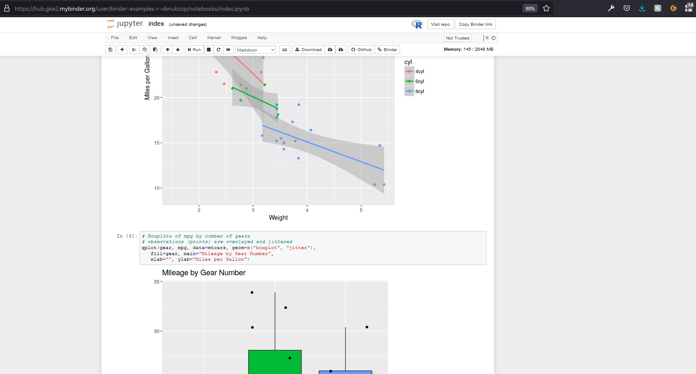

class: title, smokescreen, shelf, no-footer
background-image: url(gitpod/coding-web-gitpod-screenshot.png)

# Coding in the Web
## An introduction to GitPod and GitHub Codespaces

???

Make sure you're in the right room!
---
background-image: url(that/That-Conference-Branding-Slide.png)
background-size: cover

???

Temporary Branding slide- 2021 slide TBD

Welcome to THAT Conference

- Background images don't appear to scale correctly unless I also apply "background-size: cover" to the slide.-

---
background-image: url(that/That-Conference-Sponsors-Slide.png)
background-size: cover

???

Temporary Sponsors slide- 2021 slide TBD

Sponsors are great.  Without them, That Conference would not be possible.  I'm thankful for them.

---
background-image: url(that/That-Conference-2020.png)
background-size: cover

???

Temporary Future Dates slide- 2021-2022 slide TBD

Please consider coming back next year. Here are the dates!

---
class: img-left
# About Me

- Software Developer at Paradigm
- Luther College Alumnus
- Admin, [Madison, WI Slack](http://madisoncommunity.org/)
- Father
- Gamer
- Sports fan
- Survivor

@rosslarsonWI

hello@rosslarson.com

THAT Slack : rosslarson

???

Hi. I'm Ross.

I'm a father, a gamer, a sports fan, a geek, and other stuff.
---
# Slides and Session Information

.qrcode.db.fr.w-40pct.ml-4[]

- General session info available at https://rosslarson.com/talks/
- Slides are at https://rosslarson.com/slides/ or just use the QR code
- Ask questions anytime

???

Here's a QR Code if you want to follow along on your laptop or phone.
Ask questions anytime.
---
class: img-left

# Writing code in the web browser.

A history.
???
So, Coding in the web. It's a thing.
History of web IDEs seems pretty sparse on the web, but things started about ten years ago.
The earliest cloud IDEs I can find references to are eXo Cloud IDE and Cloud9 IDE between 2009-2011.
---
class: img-right

# Early Drawbacks

- Language support
- Performance
- SCM
- Features/Debugging

???

- Language support was rudimentary, 
- performance was subpar, 
- source code managment integration was usuoftenally missing, 
- and debugging was very difficult, if not impossible.

Because of the poor developer experience, few developers coded using web IDEs at the start.
But, time passes, and things get better. Let's skip the middle and fast-forward to now.
---
class: img-right

# Modern coding in the browser

Different tools for different goals
- Language learning 
- Code Interviews
- Notebooks
- Write and publish
- Collaboration-first 
- Fuller featured IDEs

???

There's a bunch of stuff now in different flavors, although you can tell people are still trying to figure out what people want.
I'm going to divide them into roughly six categories.
- Language learning 
- Code Interviews
- Notebooks
- Write and publish
- Collaboration-first 
- Enterprise and Cloud Service IDEs
---
class: img-caption

# Language learning 

???

Stuff made to either learn languages in a directed fashion or test snippets of language you make.

Examples:
- ["Fiddle" tools](https://fiddles.io/) 
- Try dot net
- REPLit.com
- Codingground

---
class: title, smokescreen, shelf, no-footer
background-image: url(misc/coderpad-ide-screenshot.jpg)

# Code Interviews
???

Coding tools made to record behavior and test knowledge for evaluation

Basically, a next gen whiteboard for interviews.
- [CodeBunk](https://codebunk.com/#)
- [CoderPad](https://coderpad.io/)

---
class: img-caption

# Notebooks
???

Tools made to share data and the work used to reach the results 
- data science/visualization
- [Jupyter](https://jupyter.org/try)
- R
- Julia
- [Observable (JS)](https://observablehq.com/)
---
class: title, smokescreen, shelf, no-footer
background-image: url(misc/glitch-eleventy.png)
# Write and Publish
???

Tools whose main goal is to streamline the publishing process, often in a "playground" subdomain. Allows "remixes".
- [Glitch](https://glitch.com)
---
class: title, smokescreen, shelf, no-footer
background-image: url(misc/duckly-landing-demo.gif)

# Collaboration-first 
???

Tools that prioritize collaboration and mentoring over everything, audio/video, simultaneous control
- [Duckly](https://duckly.com/)
---
class: title, smokescreen, shelf, no-footer
background-image: url(misc/google-cloud-shell.gif)
# Enterpise and Cloud Service IDEs

???

- Web IDEs focusing on delivering features to enterprises
- You may be able to configure the cloud provider you use for your virtual machine, or self-host
- Cloud IDEs making it easier to buy cloud services (AWS Lambda functions, GCP)

~~

- [AWS Cloud 9](https://aws.amazon.com/cloud9/)
- [Google Cloud Shell](https://cloud.google.com/shell/)
- [Codiad](http://codiad.com/)
- [Koding](https://www.koding.com/)
---