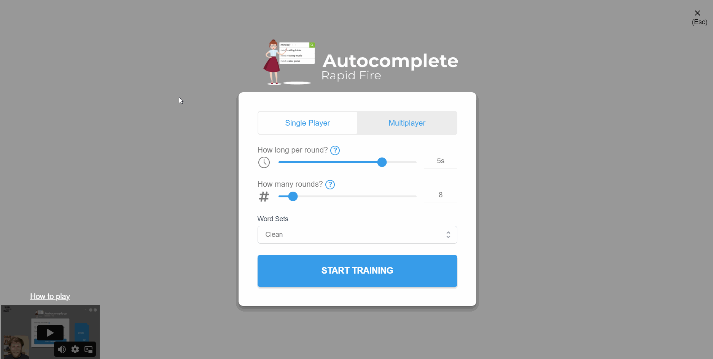
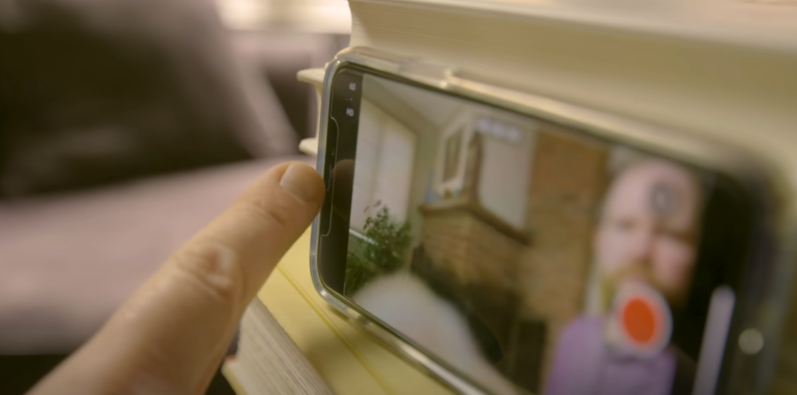
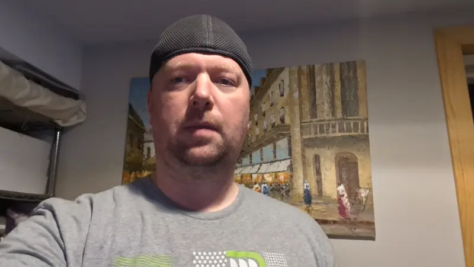
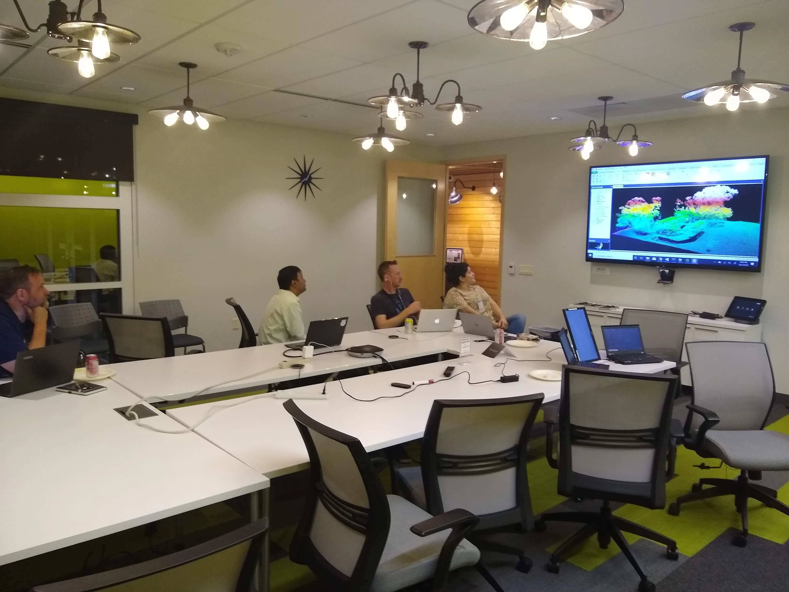
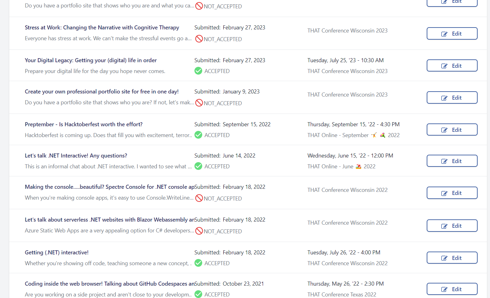
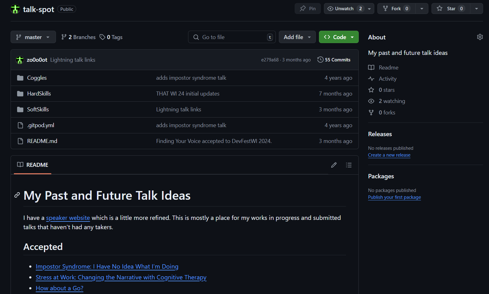
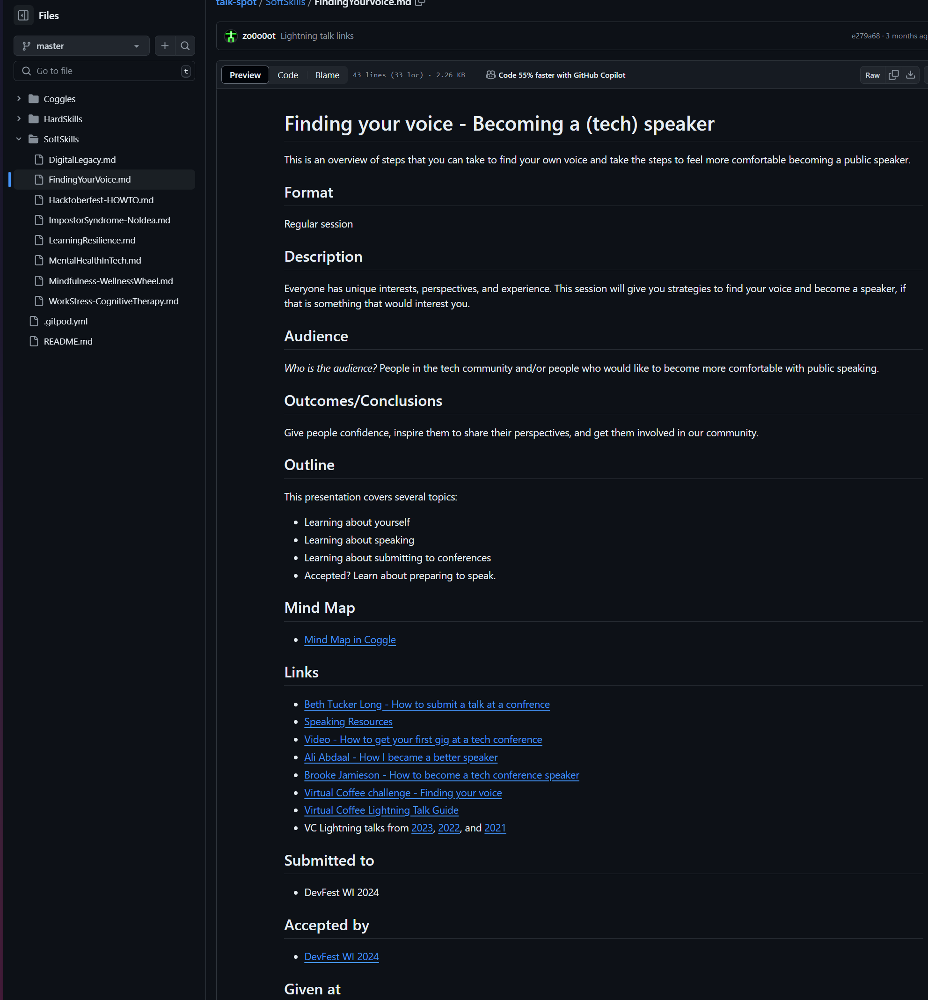
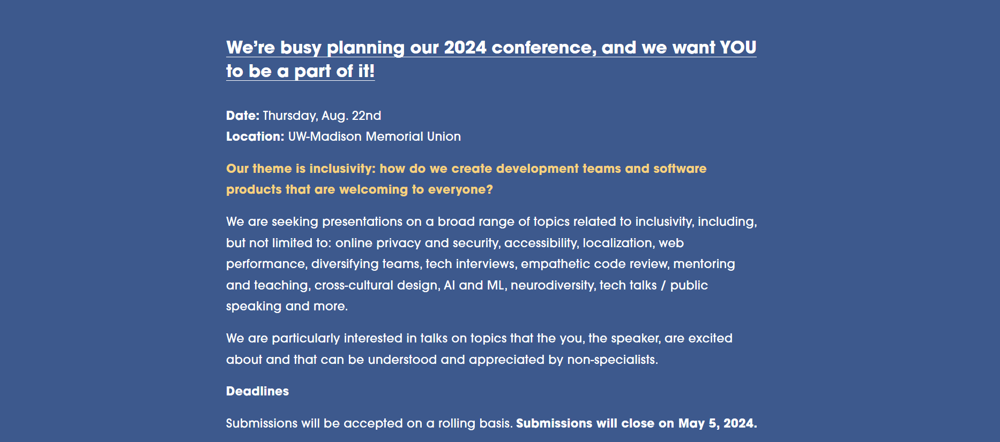
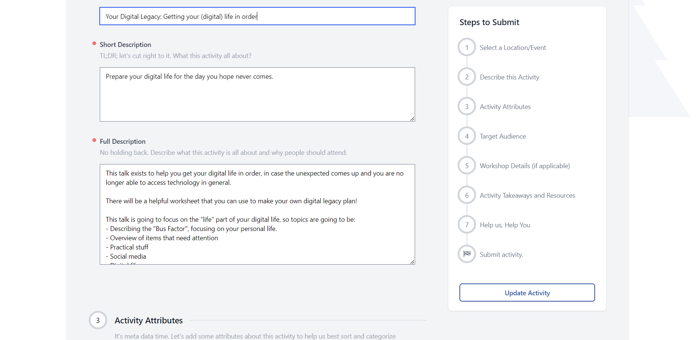
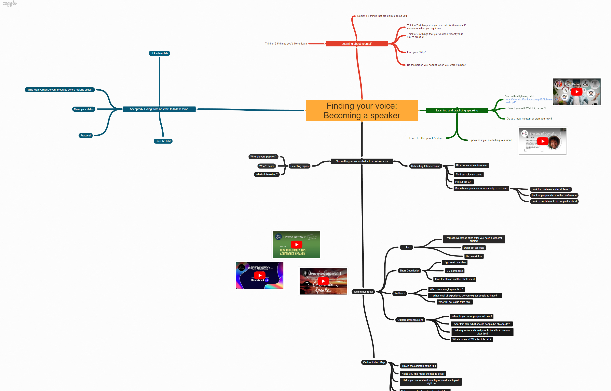

background-image: url(images/FindYourVoice.png)
background-size: cover

???

# Finding your voice! Image slide.

- Background images don't appear to scale correctly unless I also apply "background-size: cover" to the slide.
- Press C to open a new linked window, and press P to view presenter notes.

---
class: title, smokescreen, shelf, no-footer
background-image: url(images/FindYourVoice.png)

# Finding Your Voice

## Becoming a (tech) speaker

???

Make sure you're in the right room! Which is funny, since there's only one room where talks are happening.

---
class: img-left
# About Me

- Software Developer at Paradigm
- Luther College Alumnus - Psychology / French majors
- Forward Fest Board Member
- Admin, Madison, WI Slack
- Forward Madison FC Fan
- Survivor

@rosslarsonWI

hello@rosslarson.com

???

Hi. I'm Ross. I spoke at my first meetup around 2010, and I've been speaking at a variety of conferences including THAT Conference and DevFestWI. I'm involved with some other stuff, too.

---
# Slides

.qrcode.db.fr.w-40pct.ml-4[]

Slides are at https://rosslarson.com/slides/ or you can scan the QR code.

- Ask questions anytime
---
background-image: url(images/we-need-you-point-2.png)

???

I'm going to start with the main point. You can do this. I'd like to help show you how.

- Say it with me.
- "I have something of value to share with others"
---
class: col-2

# Let's find our voices, together
- Learning about yourself
- Getting comfortable speaking in public
- Submitting talks to conferences
- Getting accepted and preparing to speak

???

Here's the outline of the time we're spending together.
- We are going to do some exercises helping you describe yourself.
- I'm going to over ways to get more comfortable speaking in public.
- I'm going to talk about the process of submitting to conferences
- I'm also going to review the process from getting accepted to being ready to speak.
---
class: img-caption
# Learning about yourself - The Lens

???

- Who you are helps give you the unique perspective that other people want to hear.
- You and your experiences are the lens that you use to view and present a subject.

Think about 3-5 things that are unique about you.
The combination of seemingly common things might make you unique.
Examples:
- Where, when, and how you grew up
- What you chose to study
- What you spend your time doing (job, hobbies)
- Groups you belong to
- These things are the lens 

---
class: col-2
# What are you proud of?

- Achievements
- Interesting hacks
- Overcoming challenges
- Reinvention

???

- Think of something that you've done recently that you're proud of.
- Insights about things that make you proud could be useful to others. 

---
class: img-left
# What do you want to learn or to do?

- Learn a language or framework
- Improve a11y on a site or app
- Shoehorn AI into something
- Start a new meetup group

???

Think about what you would like to learn. 
- I can tell you from experience that there is no motivation quite like discussing the topic in front of other people.
- Think about what you would to if you weren't afraid, then do that.
---
class: img-right
# 3 subjects you could tell me about, TODAY?

- Explain for 5 minutes
- Doesn't have to be tech
- Something that has your interest
- Consider the audience

???

What's on your mind right now that you could talk about for 5 minutes with no preparation?

- It can be any topic
- It just needs to capture your interest
- When you speak, consider if your audience is completely unfamiliar with the subject, has beginner knowledge, or has similar knowledge to you

---
class: img-caption
 # Find your why.

???

Why do you want to speak?
- For better job prospects?
- For confidence?
- For the community?
- To learn?
- To teach?
- To connect?
- To share?
- What's the advice you needed to hear? Who did you need when you were starting out?  Maybe, you can be that person.
Ultimately, you're going to need to come up with your own reason.
---
class: img-caption
# Getting comfortable speaking in front of people

???
You should realize by now that you definitely have insight and information to share. 

You have found the power of the glow, and you know what you want to talk about.

Let's get more comfortable talking about it.

---
class:img-caption
# Play a game!

???

One of the ways to get better at speaking is to play games that encourage you to think and synthesize on your feet. There are games that you can play to get better at this.  [Ultraspeaking](https://app.ultraspeaking.com/games/dashboard) has games like this.
---
class:img-caption
# Make a Lightning Talk!

???

A lightning talk is:
- a short, often five to ten-minute, focused presentation. 

These talks quickly: 
 - share a new idea 
 - spark interest 
 - bring insight
 - or breakdown a topic
---
class:img-caption
# Turn on your camera/phone, and talk.

???
- Turn on your camera/phone, 
- give your lightning talk, or just speak for 3-5 minutes about anything.
- Speak as if you're talking to a friend.

One of the best ways to get more comfortable speaking is to record yourself doing it.  One way to do it is to do it and then delete the recording, and the other way is to look at the video and mute the sound.
---
class:img-caption
# Review your footage.

???
- Review yourself in one of three ways:
- Sound only
- Video only
- Video and sound
- Try to figure out if there are habits that you would like to stop, or ways to be better
---
class:img-caption
# Find a meetup, and ask to speak!

???

- Another way to get more comfortable speaking is to offer to do it at a meetup.  
- Find a meetup, contact the organizer, and ask if they need any speakers.
- The first time is a bit scary, but it gets easier, and you get better! 
- Note: this advice is easier if it's the year 2019 or before, but we're working on it.
---
class:img-caption
# Submitting to conferences

???

OK. You're getting comfortable speaking.  Let's bring this experience to a conference!

Some quick notes:
- Not all submissions get accepted.  That's normal.
- It's good to put some effort at this stage of the process.
- It's common to submit more than one idea to a conference.
---
class:img-left-full
# The CFP Process
- Refine your ideas/topics
- Find Calls for Speakers / CFPs
- Understand your due dates
- Find mentors and community
- Submit your topic(s)
- Find out the selectioned topics

???

If you want to speak, it's good to know the process to follow to become a speaker.
Generally, a few steps follow.
- We've been working on the idea and speaking process so far.
- Next, find places that are looking for speakers.
- Understand what they want, and when they want it.
- Get any help from the organizers or community
- Then submit your stuff ON TIME!
- Hopefully, things go well from there.

Let's go into the process in some more detail.
---
class: img-caption
# Tracking your ideas

???
Here's a tip. Track your ideas somewhere.  

- It's easier to look at a list of ideas and refined topics than to try to make them up from scratch the next time you see a call for presenters.
- I use markdown and GitHub 
- You can use anything as long as you can access it, add to it, and edit it. 
- Not all CFP processes will send you a copy of what you write, so it's good to store somewhere.
---
class:img-right-full
# Idea format:

- Title 
- Format
- Description
- Audience
- Outcomes / Conclusions
- Outline
- Mind Map / Links
- Submitted / Accepted / Given

???
What I'm showing you isn't a standard thing, but it is what I use to track my ideas.

- Title : A brief memorable description
- Format : How long is this talk? Is it a workshop? Lightning talk?
- Description : 3-5 sentences describing the content and goals of the talk.
- Audience : Who are the people you are trying to reach? Job? Experience level?
- Outcomes / Conclusions : What should people learn or be able to do at the end of the talk?
- Outline : What's the general structure?
- Mind Map / Links : Links to any related material or articles, or a mind map
- Submitted / Accepted / Given : Where have you submitted this talk? Track the progress.
---
class:img-caption
# Finding a CfP (Call for Presenters)

???
You have ideas. You want to present. Conferences need presenters.  What happens?
- Usually, you find a CFP, or call for presenters/papers.
- A CFP usually indicates the date, the place, and sometimes the preferred subjects for presentation.
- There is usually a deadline, several months before the conference.  Pay attention to that.
- Check your calendar, and look at your list of ideas. It's time to get to work.
---
class:img-caption
# Submitting a talk

???
- Some conferences have something like a google form
- Other conferences have more complex interfaces
- Determine if your entry can be edited, or if it should be considered complete on submission.
- If you're new, it is 100% OK to ask for feedback before you submit.
---
class:img-caption
# Finding mentors and help

???
# How do I ask for help?
Good question.
- First, look for the official channels. Does the CFP list any email address?
- Next, look for any official conference Slack or Discord channels, and social media
- Then, use anyone that you know in your personal network.
- Ask for feedback, then listen to the suggestions. Lather, rinse, repeat!
---
class:img-caption
# The Mind Map

???
Not everyone does this, but I get value from making a mind map.
- It helps me understand my main points before I make slides
- It also helps me understand how much time I might want to spend on each concept
- Generally, you put the main topic at the center
- Connect your main point to the center
- Connect supporting information on your points
- Link related blog posts or videos, if applicable.
---
class:compact
 ### Image Credits
- Pointing finger based on Uncle Sam index finger from [pngegg](https://www.pngegg.com/en/png-skbnq)
- People silhouettes from [pngegg](https://www.pngegg.com/en/png-zvrmp)
- Camera lenses from [Petapixel guide on camera lenses](https://petapixel.com/types-of-camera-lenses/)
- Award ribbon from [pngegg](https://www.pngegg.com/en/png-ipdkr)
- Stack of books from [pngegg](https://www.pngegg.com/en/png-exeli)
- Screenshot by me from the game [No Man's Sky](https://www.nomanssky.com/) by Hello Games
- Question mark from [Wikimedia](https://upload.wikimedia.org/wikipedia/commons/c/c8/Question_mark_1.svg)
- Speaker on cube from [pngegg](https://www.pngegg.com/en/png-iqbqz)
- lightning from [pngegg](https://www.pngegg.com/en/png-bemds)
- gif of game is from [Ultraspeaking](https://app.ultraspeaking.com/games/dashboard)
- selfie from Self-Recording Video Tutorial on [University of Rochester Youtube channel](https://youtu.be/BgUAlw4myrs?si=3uCsxzWdK3-IP8Xv)
- Video of me, courtesy of my face
- Picture is of Madhackers meetup in 2019, picture taken by me
- Submission page is a partial list of my submissions to THAT Conference.
- Talk ideas page is a screenshot of my [talk ideas repo](https://github.com/zo0o0ot/talk-spot), based off of [mercedesb](https://github.com/mercedesb/talk-spot)
- Talk format image is of my FindingYourVoice.md markdown file on [GitHub](https://github.com/zo0o0ot/talk-spot/blob/master/SoftSkills/FindingYourVoice.md)
---
class:compact
 ### Image Credits - Page 2
- CFP image message courtesy of [DevFestWI CFP blog](https://www.devfestwi.com/news/call-for-speakers-2024)
- Tree of hands from [pngegg](https://www.pngegg.com/en/png-ptkna)
- Mind map of this topic from me on [coggle](https://coggle.it/diagram/Zkv4VAQxRwpIgG65/t/finding-your-voice-becoming-a-speaker/381b7a555829d4004b5c861428f79e9a2313948d34539c577f43753033fb36f3)