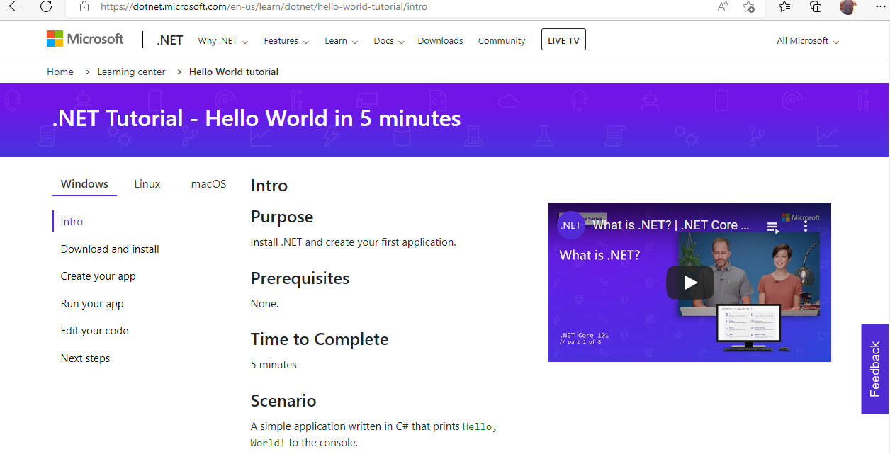
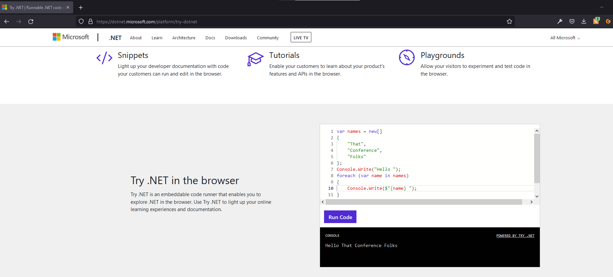
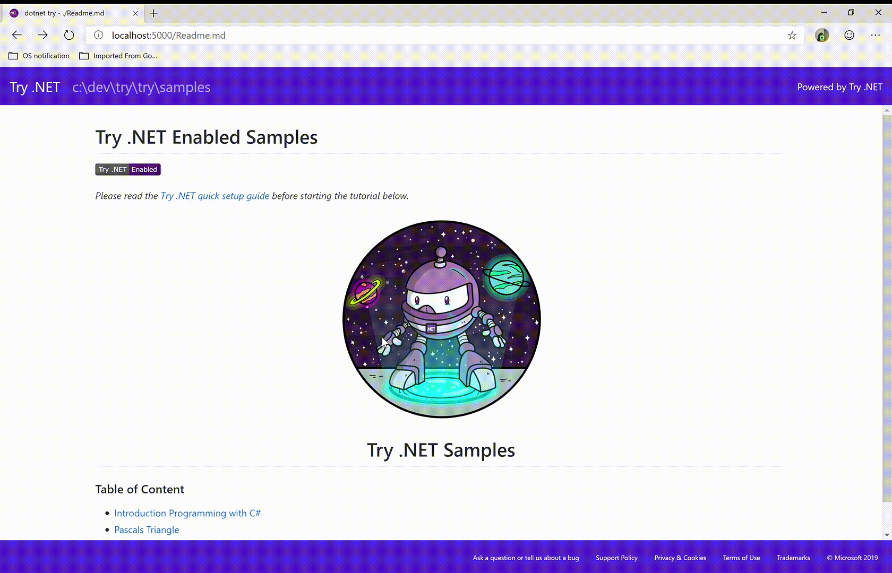
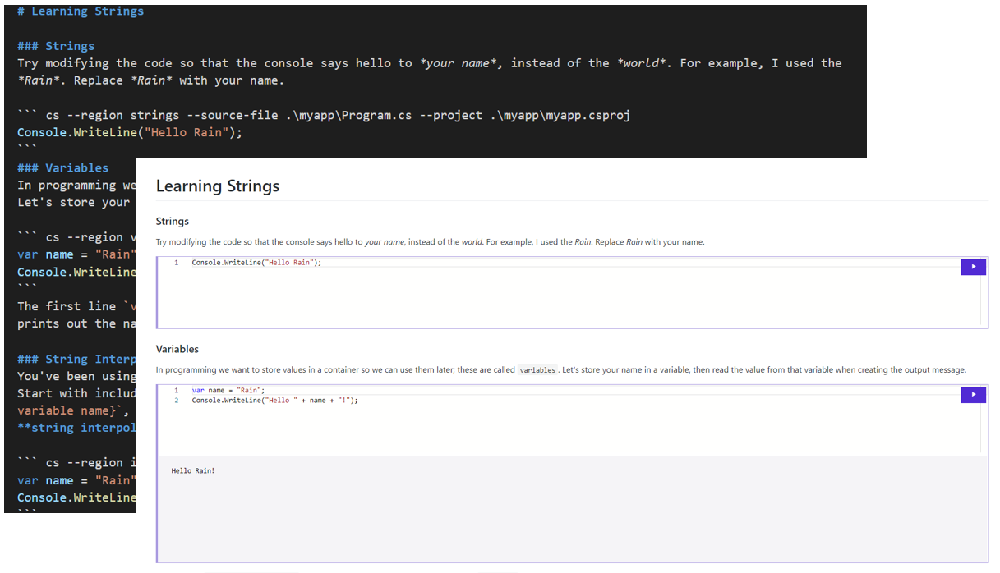
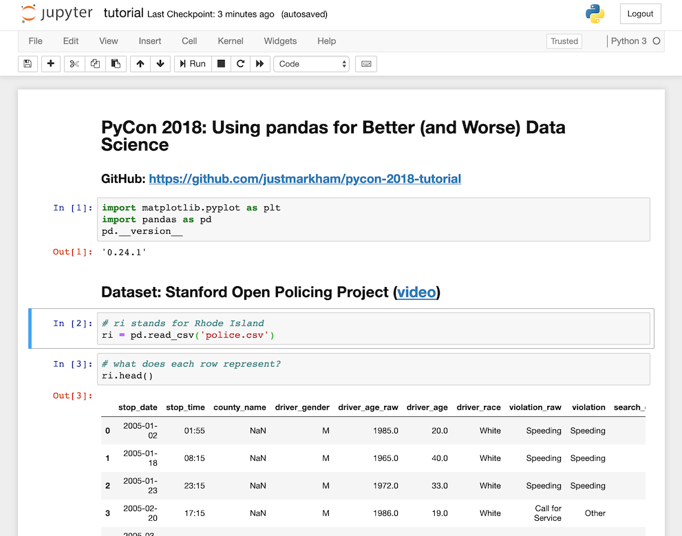

class: title, smokescreen, shelf, no-footer
background-image: url(images/dotnet-interactive.png)

# Getting (.NET) Interactive!
## An introduction to .NET Interactive Notebooks

???

Make sure you're in the right room!
---
background-image: url(that/That-Conference-Branding-Slide.png)
background-size: cover

???

# Welcome to THAT Conference 2022!

- Background images don't appear to scale correctly unless I also apply "background-size: cover" to the slide.-

---
background-image: url(that/That-Conference-Partners-Slide.png)
background-size: cover

???
# Sponsors 

Sponsors are great.  Without them, That Conference would not be possible.  I'm thankful for them.

---
background-image: url(that/THAT.us.png)
background-size: cover

???

That.us is pretty great.  Come and join the conversation, all year long!

---
background-image: url(that/THAT-Dates.png)
background-size: cover

???

Also.... It's never to early to start thinking about next year!

---
class: img-left
# About Me

- Software Developer at Paradigm
- Luther College Alumnus
- Admin, [Madison, WI Slack](http://madisoncommunity.org/)
- Father
- Gamer
- Sports fan
- Survivor

@rosslarsonWI

hello@rosslarson.com

THAT Slack : rosslarson

???

Hi. I'm Ross.

I'm a father, a gamer, a sports fan, a geek, and other stuff.

Important to note here: 
The coding usually I do in my free time is:
-  Hugo Static sites and 
- .NET Core apps, often webscrapers.
---
# Slides and Session Information

.qrcode.db.fr.w-40pct.ml-4[]

- General session info available at https://rosslarson.com/talks/
- Slides are at https://rosslarson.com/slides/ or just use the QR code
- Ask questions anytime

???

Here's a QR Code if you want to follow along on your laptop or phone.
Ask questions anytime.
---
class: top
# A history of working with .NET interactively.

???

Dotnet has been around for a while, but trying it out used to involve quite a few steps, such as:
- Downloading and installing Visual Studio
- Installing a dotnet SDK
- Creating a project or app
- Running or debugging the program to see output.

It was the way things were always done, but there was certainly room for improvement.
---
class: col-2

# Drawbacks to Traditional .NET in Visual Studio

- Big initial download and setup
- Initial output is mostly limited to debugging and print statements
- Hard to share results of analysis steps

???

- The initial setup of Visual Studio can be daunting.  The install size for Visual Studio Community including suggested SDKs and tools is about 30-50 GBs nowadays.
- Getting past the initial "Hello World" phase can take some time, and your early output is going to probably be print statements and looking at variables in immediate window while debugging.
- Visual Studio isn't really built to store the output of the code you write, as it was written with development of the application in mind, not necessarily the output.

---
class: img-caption

## The first big step - Try.NET in the browser

???

- In 2019, .NET started to move foward to the web in a new way.
- A REPL (Read-Eval-Print Loop) isn't a new concept, but because C# did not start as a web language, it wasn't close to the first language
- Try dot net in the browser was a pretty big step for the .NET stack.
- Apparently, at the start, Microsoft was footing the bill for azure virtual machines that were connecting with every site visitor that wanted to try dotnet in the browser.
- Eventually, Blazor allowed them to save on some server costs.
---
class: img-caption

# `dotnet try` - Creating your own interactive documentation

???

- The website was cool, and it allowed for experimentation, but what about if you wanted to make something interactive for yourself, or someone else?
- The dotnet try tool allows you to match markdown and editable, executable code to be created and served up for yourself or someone else.
- A good example of this is the [hello world](https://docs.microsoft.com/en-us/dotnet/csharp/tour-of-csharp/tutorials/hello-world) tutorial on the Micosoft docs site.

---
class: col-2
# Running `dotnet try` locally

- Run `dotnet try` from the console 
- (or server)

- Markdown mixed with code
- Friendly presentation
- Code is editable by end-user

???

- If you run `dotnet try` locally, it will start a webserver and serve the content into a browser, where you can interact with code blocks and see their results.
- `dotnet try` is pretty cool, but it still requires the user to run the program themselves.
- Also, you run the risk of things running differently on their computer if different packages or versions of things are installed.

---
class: img-caption

# Meanwhile, an (old?) new tool appears from a different land....

???

# Jupyter - a different tool for a different purpose

Jupyter Notebook (formerly IPython Notebooks) is a web-friendly interactive computational environment for creating notebook documents.

---
class: img-caption

# A document-based development model

???

# Jupyter - Document-based development for sharing

A Jupyter Notebook document is a REPL containing an ordered list of input/output cells which can contain code, text (using Markdown), mathematics, plots and rich media. Underneath the interface, a notebook is a JSON document, following a versioned schema, usually ending with the ".ipynb" extension. 

The project was original brought together to support Julia, Python, and R and help those languages create easily consumable and reproducable content.

You may see some similarities between this and `dotnet-try`.

---
class: img-caption

# Also Emerging: Visual Studio Code
???
# Visual Studio Code
- Visual Studio Code came out in 2015, [and has been evolving rapidly, as well](https://en.wikipedia.org/wiki/Visual_Studio_Code).
- Their extensions marketplace has allowed for rapid evolution of the editor, and new functionality has been quickly appearing.

---
class: col-2
# Now........ Let our powers combine!

-  Visual Studio Code
-  Jupyter Notebooks
-  .NET Interactive
-  Open Source
-  Heart

???
# Notebooks are a combination of several powers

- VS Code
- Jupyter
- DotNet Interactive Kernel
- Open Source
- Heart

- Because of the beauty of open source, a rising tide lifts all boats.....
- Microsoft was able to add a .NET Interactive Kernel into Jupyter Notebooks.
- Microsoft then added .NET Notebooks support to VS code via VS Code Extensions
    - First to VS Code (and [nteract](https://nteract.io/), and Azure Data Studio)
    - Then to Visual Studio (as of this month)
- Add some heart, and you have .NET Interactive notebooks! 
---
class: img-caption

# So, How am I supposed to use .NET Interactive?

???

This seems interesting, but how am I supposed to use a tool like .NET Interactive?

Good question!
---
class: img-right
# You can choose your own adventure!

- Learning Experiences
- Data Prep
- Data Exploration
- Troubleshooting
- Documentation / Onboarding
- Visualization
- Prototyping

???
# The power is yours!

What you can do with a .NET Interactive Notebook is going to be defined by you expertise and interest.

Some possible ideas:

- Learning Experiences
- Data Prep
- Data Exploration
- Troubleshooting
- Documentation / Onboarding
- Visualization
- Prototyping

---
class: col-2
# .NET Interactive Notebooks - Pros and Cons

## Pros
- Integrations for:
    - VS Code, 
    - Visual Studio, 
    - Azure Data Studio
    - and more!
- Broad .NET support + SQL/KML
- Polyglot language support
- SandDance makes cool visuals
- Support from multi-billion dollar company

## Cons
- Still in development - rough edges
- Embedding and sharing interactivity requires a few confusing steps
- Troubleshooting issues can be a pain
- Understanding differences from Jupyter can be be tough
- Codespaces support is buggy sometimes

???
# Pros and Cons
---
class: img-caption

# Demo Time!

???

# Demos

- Programming model (from Interactive - show batteries included)
- Displaying output (show variable and display commands)
- Formatting output (show messy data display get clean)
- Importing packages (create and import somthing.csx)
- Variable Sharing (sharing across languages)
- Show AIS ships (polyglot, load from file, use all of Norway)
    + AIS: Automatic Identification System
- NFL Draft Notebook (DataFrames and SandDance)
- Mermaid (Show off cool flow charts)
- American Soccer Analysis (If extra time available)

I made my own repo on [GitHub](https://github.com/zo0o0ot/THAT-dotnet-interactive) so that going over these notebooks is less complicated.
You can [open it in Binder](https://mybinder.org/v2/gh/zo0o0ot/THAT-dotnet-interactive/main?urlpath=lab) and most examples work.

---

class: img-caption

# Questions? Thoughts?

???

# Any Questions?

---
background-image: url(images/bow-thank-you.webp)
background-size: stretch

# Thanks!

???

# Thanks!
---
 ### Credits
- THAT Conference Cartoons courtesy of THAT Conference, © 2021 THAT® All rights reserved.
- Picture of a sad dog courtesy of user pinoyed on [flickr](https://www.flickr.com/photos/pinoyed/5009440499/in/photostream/). Image description: Murray's sad face. - Creative Commons Attribution 2.0 Generic (CC BY 2.0)
- "Captain Planet Combine" gif courtesy of Damien G via [giphy](https://giphy.com/gifs/captain-planet-planeteers-letourpowerscombine-kQYNaEa35hQ6pCYywH) - Captain planet courtesy of the 1990's, Ted Turner, and TBS.
- "Looking let me think" gif courtesy of TipsyElves.com via [giphy](https://giphy.com/gifs/tipsyelves-math-26gR0YFZxWbnUPtMA)
- "Drunk Boston Dynamics" gif courtesy of Lion Beach via [giphy](https://giphy.com/gifs/lionbeach-boston-dynamics-fPI2ymej8ZEBI332VN). The people at [Boston Dynamics](https://www.bostondynamics.com/) also deserve credit, and I sincerely hope that evil robots do not rise up and take over the world.
- "Feelings Thoughts" gif courtesy of Chuber Channel via [giphy](https://giphy.com/gifs/chuber-feelings-thoughts-questions-XHVmD4RyXgSjd8aUMb)
- "Bow Thank You" gif courtesy of Out of Office via [giphy](https://giphy.com/gifs/3ZZD9fwwaI8u7hQe1P)
