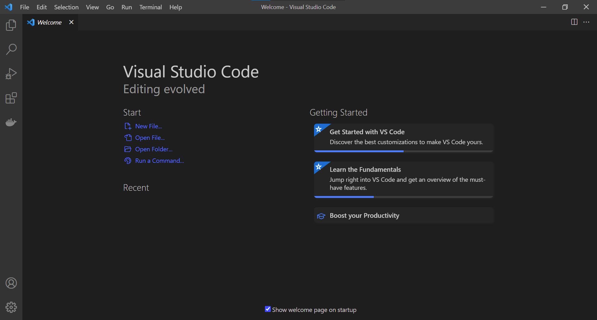

class: title, smokescreen, shelf, no-footer
background-image: url(images/dotnet-interactive.png)

# Getting (.NET) Interactive!
## An introduction to .NET Interactive Notebooks

???

Make sure you're in the right room!
---
background-image: url(that/01-THAT-Conference-Branding.png)
background-size: cover

???

# Welcome to THAT Conference 2022!

- Background images don't appear to scale correctly unless I also apply "background-size: cover" to the slide.-

---
background-image: url(that/02-THAT-Conference-Partners.png)
background-size: cover

???
# Sponsors 

Sponsors are great.  Without them, That Conference would not be possible.  I'm thankful for them.

---
background-image: url(that/03-THAT.us.png)
background-size: cover

???

That.us is pretty great.  Come and join the conversation, all year long!

---
class: img-left
# About Me

- Software Developer at Paradigm
- Luther College Alumnus
- Admin, [Madison, WI Slack](http://madisoncommunity.org/)
- Father
- Gamer
- Sports fan
- Survivor

@rosslarsonWI

hello@rosslarson.com

THAT Slack : rosslarson

???

Hi. I'm Ross.

I'm a father, a gamer, a sports fan, a geek, and other stuff.

Important to note here: 
The coding usually I do in my free time is:
-  Hugo Static sites and 
- .NET Core apps, often webscrapers.
---
# Slides and Session Information

.qrcode.db.fr.w-40pct.ml-4[]

- General session info available at https://rosslarson.com/talks/
- Slides are at https://rosslarson.com/slides/ or just use the QR code
- Ask questions anytime

???

Here's a QR Code if you want to follow along on your laptop or phone.
Ask questions anytime.
---
class: img-caption

# A history of working with .NET interactively.

???

Dotnet has been around for a while, but trying it out used to involve quite a few steps, such as:
- Downloading and installing Visual Studio
- Installing a dotnet SDK
- Creating a project or app
- Running or debugging the program to see output.

It was the way things were always done, but there was certainly room for improvement.
---
class: col-2

# Drawbacks to Traditional .NET in Visual Studio

- Big initial download and setup
- Initial output is mostly limited to debugging and print statements
- Hard to share results of code

???

- The initial setup of Visual Studio can be daunting.  The install size for Visual Studio Community including suggested SDKs and tools is about 30-50 GBs nowadays.
- Getting past the initial "Hello World" phase can take some time, and your early output is going to probably be print statements and looking at variables in immediate window while debugging.
- Visual Studio isn't really built to store the output of the code you write, as it was written with development of the application in mind, not necessarily the output.

---
class: img-caption

## The first big step - Try.NET in the browser

???

There's a bunch of stuff now in different flavors.

Companies are still trying to figure out what people want (and will pay for).

I'm going to divide everything into roughly seven categories, and explain the goals of each.
- Language Learning 
- Code Interviews
- Notebooks
- Write and Publish
- Collaboration-first 
- Enterprise and Cloud Focused
- Repository Superchargers
---
class: title, smokescreen, shelf, no-footer
background-image: url(images/dotnet-try.gif)

# `dotnet try` - Creating your own interactive documentation

???

- The website was cool, but what about if you wanted to make something interactive for yourself, or someone else?

---
class: img-caption

# Running `dotnet try` locally

???

- If you run `dotnet try` locally, it will start a webserver and serve the content into a browser, where you can interact with code blocks and see their results.
- `dotnet try` is pretty cool, but it still requires the user to run the program themselves.
- Also, you run the risk of things running differently on their comptuer if different packages or versions of things are installed.

---
class: img-caption

# Meanwhile, an (old?) new tool appears from a different land....

???

# Jupyter - a different tool for a different purpose

Jupyter Notebook (formerly IPython Notebooks) is a web-based interactive computational environment for creating notebook documents.

A Jupyter Notebook document is a browser-based REPL containing an ordered list of input/output cells which can contain code, text (using Markdown), mathematics, plots and rich media. Underneath the interface, a notebook is a JSON document, following a versioned schema, usually ending with the ".ipynb" extension. 

The project was original brought together to support Julia, Python, and R and help those languages create easily consumable and reproducable content.

---
class: img-caption

# Also Emerging: Visual Studio Code
???
# Visual Studio Code
- Visual Studio Code came out in 2015, [and has been evolving rapidly, as well](https://en.wikipedia.org/wiki/Visual_Studio_Code).
- Their extensions marketplace has allowed for rapid evolution of the tool.

---
class: col-2
# Let our powers combine

???
# Notebooks
---
class: title, smokescreen, shelf, no-footer
background-image: url(misc/glitch-1.gif)
# Write and Publish
???
# Write and Publish
Web tools whose main goal is to streamline the creation and publishing process, often in a "playground" subdomain. Allows "remixes".
- [Glitch](https://glitch.com)
- [WebContainers](https://blog.stackblitz.com/posts/introducing-webcontainers/)
---
class: title, smokescreen, shelf, no-footer
background-image: url(misc/duckly-landing-demo.gif)

# Collaboration-first 
???
# Collaboration-first 
Tools that prioritize collaboration and mentoring over everything else. 
Has audio/video, and simultaneous control
- [Duckly](https://duckly.com/)
---
class: title, smokescreen, shelf, no-footer
background-image: url(misc/google-cloud-shell.gif)
# Enterpise and Cloud Service IDEs

???

# Enterpise and Cloud Service IDEs

- Web IDEs focusing on delivering features to enterprises
- You may be able to configure the cloud provider you use for your virtual machine, or self-host
- Cloud IDEs making it easier to buy cloud services (AWS Lambda functions, GCP)

~~

- [AWS Cloud 9](https://aws.amazon.com/cloud9/)
- [Google Cloud Shell](https://cloud.google.com/shell/)
- [Codiad](http://codiad.com/)
- [Koding](https://www.koding.com/)
- [CodeAnywhere](https://codeanywhere.com/)
- [GoormIDE](https://ide.goorm.io/)
---
class: col-2
# Repository Superchargers
Gitpod

GitHub Codespaces

???
# Repository Superchargers

My final category.

These are tools that make working with open source repositories easier. 

They open your repo in a customizable docker container that can allow you functionality that usually comes only on desktop IDEs.

There's also a streamlined commit and push process.

- [Gitpod](https://www.gitpod.io/)
- [GitHub Codespaces](https://github.com/features/codespaces)

Here's what I'm going to talk about today.
---
# How are Gitpod and Codespaces similar?

- Broad language support, auto-complete, intellisense
- Configurable color themes
- Integrated debugger
- Integration with GitHub repositories
- Free tier available
- Uses Visual Studio Code*
- Allows VS Code Extensions*
- iPad support
- VNC Support

???
# How are Gitpod and Codespaces similar?

There are quite a few similarities between the two products.  

If you use one, it shouldn't be hard to use the other.

Both use VS Code by default, integrate with GitHub, and offer some pretty nice language support.

They can also be customized with different color themes and extensions.
---
# Gitpod and Codespaces - Differences

| Gitpod      | Codespaces                      |
|---------------------------------------------------|-------------------------------------------------------------------------------|
| Support for GitHub, GitLab, and Bitbucket         | GitHub-only                                                                   |
| Open for sign-ups, use right away                 | Private beta with sign-up page                                                |
| Released product with pricing and free tier       | Free, "for now" while in beta                                                 |
| Collaboration through shared workspace or snapshot| Visual Studio Live-share                                                      |
| No integration with AI Copilot                    | Integrates with AI Copilot (beta), but you have to be in both beta programs   |
| Local IDE connection in preview                   | Can connect to a local install of VS Code                                     |
| You can self-host on kubernetes                   | Not available to self-host                                                    |

???
# Gitpod and Codespaces - Practical Differences

- Gitpod has support for GitHub, GitLab, and Bitbucket. Codespaces is limited to GitHub.
- Gitpod has been around since 2018 with a userbase and published pricing. Codespaces is still in beta as of 2021, though it is free if you can get in via the [sign-in page](https://github.com/features/codespaces/signup).
- Collaboration in Codespaces is done with VS Live Share. Gitpod handles collaboration via shared workspaces, or by creating shareable snapshots.
- Codespaces integrates with AI Copilot(beta) via a VS Code Extension, but you have to be accepted into both beta programs. Copilot is not available for Gitpod.
- There's a VS Code extension to allow you to connect a local install of VS Code GitHub Codespaces. Gitpod is working on connecting to local IDEs with [Gitpod Local Companion](https://www.gitpod.io/docs/develop/local-companion), but it is still in preview.
- If you're motivated, you can self-host Gitpod on kubernetes. It's not currently possible with Codespaces (though VS Codespaces did have that option).

---
# Gitpod and Codespaces - Philosophy
| Gitpod      | Codespaces                      |
|---------------------------------------------------|-------------------------------------------------------------------------------|
| Open-Source                                       | Proprietary                                                                   |
| VS Code - Open Source Version                     | VS Code - Proprietary version                                                 |
| VS Code Extensions - Open VSX Registry            | VS Code Extensions - Extension Marketplace                                    |
| Ephemeral (built fresh every time)                | Only rebuilds image on config change (starts existing VM)                     |
| Prebuilds - allows precompiling certain items     | Rebuilds from scratch based on config                                         |
| Tasks - Run commands before opening IDE           | Does not appear to support running commands before opening                    |

???
# Philosophical Differences

- Gitpod is [open-source](https://github.com/gitpod-io), Codespaces is proprietary.
- While [VS Code is open source](https://github.com/microsoft/vscode), Codespaces uses a proprietary version of VS Code.
- Extensions also work differently, Microsoft has the proprietary [Extension Marketplace](https://marketplace.visualstudio.com/), Gitpod uses the [Open VSX Registry](https://open-vsx.org/)
- Gitpod environments are designed to be ephemeral, rebuilt every time you need one. Codespaces seems to keep your container handy, and restarts it when you need it again, only rebuilding if you change the configuration of the container.
- Gitpod has an option to offload some of the compilation process outside of the startup process in what they call "Prebuilds".  That seems cool.
- Gitpod also allows you to run tasks, like restoring packages or running commands before the web IDE starts.  I'm not aware of Codespaces being able to do this.
---
class: img-caption

 # Demos!

???
Enough talking. Let's do a demo of Gitpod and Codespaces.

Note: I'm not starting these virtual machines from scratch.  That seems like a disaster waiting to happen.

---
class: img-caption

# Gitpod

???
- Show off Hugo site.
- Change color themes
- Show .gitpod.Dockerfile and .gitpod.yml 
- Note that "tasks" allow running a hugo server automatically

---
class: img-caption

# GitHub Codespaces

???
- do dotnet restore
- Show off debugging.
- Show off Copilot.
- Show devcontainer.json file and Dockerfile
---
class: title, smokescreen, shelf, no-footer
background-image: url(that/bigfoot-with-that-badge.png)

# Should I use Gitpod or Codespaces?

???

Should I use Gitpod or Codespaces?
---
background-image: url(misc/both2.gif)
background-size: cover

???

Which one should you use? Maybe both of them? I'd certainly suggest trying Gitpod first, since you don't have to wait to do it. I certainly prefer it when working on Hugo Static Sites.

However, Codespaces is nice, too. Since GitHub is a Microsoft product, any new GitHub features may come to Codespaces first, though they may come in beta signup form like AI Copilot.

Both products are still under active development, so I would encourage you to pay attention to both Gitpod and Codespaces as they continue to add features and improve.
---
class: img-caption

# Questions?

???

# Any Questions?
---
background-image: url(misc/thankyou.webp)
background-size: cover

???

# Thanks!
---
 # Credits

- THAT Conference Cartoons courtesy of THAT Conference, © 2021 THAT® All rights reserved.
- Picutre of a sad dog courtesy of user pinoyed on flickr. Image description: Murray's sad face. - Creative Commons Attribution 2.0 Generic (CC BY 2.0) - https://www.flickr.com/photos/pinoyed/5009440499/in/photostream/
- "Demo" gif of Yaphit doing tech support comes from "The Orville" created by Seth MacFarlane
- "Both" gif is from "The Road To El Dorado", Directed by Bibo Bergeron and Don Paul
- "Looking let me think" gif courtesy of TipsyElves.com
- "Thank you" gif is from Super Mario World, Ending screen
- Web IDE screenshots courtesy of their respective sites.