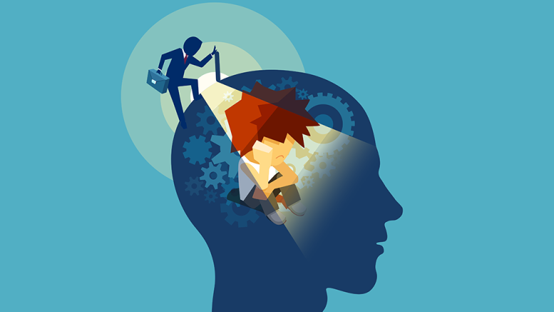

background-image: url(images/FF22SponsorSlide.png)
background-size: cover

???

# Welcome to DevFest WI and Forward Fest!

- Background images don't appear to scale correctly unless I also apply "background-size: cover" to the slide.-
---
class: title, smokescreen, shelf, no-footer
background-image: url(images/noideadog.jpg)

# Impostor Syndrome and Advocacy
## Getting from "I have no idea what I'm doing" to Advocating for others

???

Welcome! Thanks again to Jen for her talk on tracking your impact and announcing your accomplishments!

---
# Slides and Session Information

.qrcode.db.fr.w-40pct.ml-4[]

- General session info available at https://rosslarson.com/talks/
- Slides are at https://rosslarson.com/slides/ or just use the QR code
- Ask questions anytime

???

Here's a QR Code if you want to follow along on your laptop or phone.
Ask questions anytime.

---
background-image: url(gs/01-impostors.png)
background-size: cover

???

# What do these four characters have in common? (Mulan, Valjean, Aladdin, Daniel Hillard)

- Background images don't appear to scale correctly unless I also apply "background-size: cover" to the slide.-
---
background-image: url(gs/02-impostors.png)
background-size: cover

???

# They’re all impostors.

- (Ping, Monsieur Maire, Prince Ali, Mrs. Doubtfire) Our fiction is full of them.  (Dexter, 21 Jump Street, Pysch, Kindergarten Cop) In fiction, it’s fun to watch an impostor, but it isn’t fun to be one.
---
class: img-left
# About Me

- Software Developer at Paradigm
- Psychology/French major - Luther College 
- Admin, [Madison, WI Slack](http://madisoncommunity.org/)
- Father
- Survivor
- Impostor

@rosslarsonWI

hello@rosslarson.com

???

Hi. I'm Ross.

I'm a father, a gamer, a sports fan, a geek, a survivor, and an impostor.

Here’s my story.  School.  Call Center. 2009. FVTC. Farming Cooperative.
I’ve been paid to code in eight languages, give or take (Java, Javascript, Visual FoxPro, VB/Access, ABAP, PHP, C#, Python).
---
class: img-caption

# Impostor Syndrome in Psychology

???

You’ve heard my story, let’s look at the psychology.
---
background-image: url(images/psych-word-brain-cloud.jpg)
background-size: stretch

???

OK, quick course in Psychology.  I studied it for four years.  PhD’s study for about a decade or so.  I’m going to give you some basics in like 5 minutes.
---
class: title

# Clinical Signficiance

???

# Clinical Significance

The threshold under which treatment should be considered.  

- Work
- Life
- Relationships

Example, anxiety versus a clinical anxiety disorder.

---

class: title

# Pills vs. Skills

???

Treatment for psychological issues falls into two varieties.  Pills and skills.
-  Pills = drugs.  
- Skills = 
    - Behavioral therapy
    - Group therapy
    - Coping mechanisms, 
    - Counseling, 
    - Self-care.

---
class: title, fogscreen, shelf, no-footer
background-image: url(images/whynotboth.webp)
background-size: cover

# Comorbidity

???

# Comorbidity
Either a condition existing simultaneously but independently with another condition or a related medical condition. 
(Anxiety and Depression, ADD and Depression, etc.)

---
class: title

# Stigma of Mental Health

???

Way back in 1999 the U.S. Surgeon General labeled stigma as perhaps the biggest barrier to mental health care; this stigma manifests particularly in a phenomenon known as social distancing, whereby people with mental issues are more isolated from others.

But most of them are scared to talk about it. Only 41% of people with a mental disorder get professional help. Help is available, but because we aren’t talking about mental health openly, and we don’t put the time in to educate ourselves about resources, people don’t get what they need. So they stay sick, and suffer unnecessarily.

About 1 in 5 in tech are currently dealing with a mental health issue right now.
---

class: title

# Self-Care
## (it's not selfish)

???

# Self-care behaviors: 
- Mediation
- Diet
- Fitness
- Hygiene
- Monitoring
- Mindfulness.  

Having trouble?  There’s a website:  http://youfeellikeshit.com/ 

http://philome.la/jace_harr/you-feel-like-shit-an-interactive-self-care-guide/play

---
class: title

# Cognitive Bias

???

A cognitive bias refers to the systematic pattern of deviation from norm or rationality in judgment, whereby inferences about other people and situations may be drawn in an illogical fashion

---

class: img-caption

# Questions? Thoughts?

???

# Any Questions?

---
background-image: url(images/bow-thank-you.webp)
background-size: stretch

# Thanks!

???

# Thanks!
---
 ### Credits

- The "I have no idea what I'm doing" dog is Bailey the Golden Retriever. Courtesy of Redditor [Golden_Bailey](https://www.reddit.com/user/Golden_Bailey/?sort=top). History of meme is [here](https://knowyourmeme.com/memes/i-have-no-idea-what-im-doing).
- Pictures of movie impostors are from their respective studios.  Please consider this fair use and don't sue me.
- Person inside of person's head image courtesy of [http://psychlearningcurve.org](http://psychlearningcurve.org/increasing-community-awareness-of-the-value-of-psychology-skills/)
- Psychology word cloud courtesy of [studiousguy.com](https://studiousguy.com/psychology/)
- Why not both meme courtesy of Old El Paso Commercial. Relevant meme [here](https://knowyourmeme.com/memes/why-not-both-why-dont-we-have-both).
- "Feelings Thoughts" gif courtesy of Chuber Channel via [giphy](https://giphy.com/gifs/chuber-feelings-thoughts-questions-XHVmD4RyXgSjd8aUMb)
- "Bow Thank You" gif courtesy of Out of Office via [giphy](https://giphy.com/gifs/3ZZD9fwwaI8u7hQe1P)

