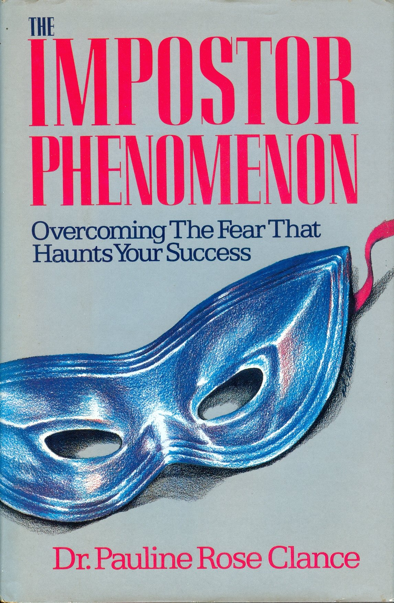
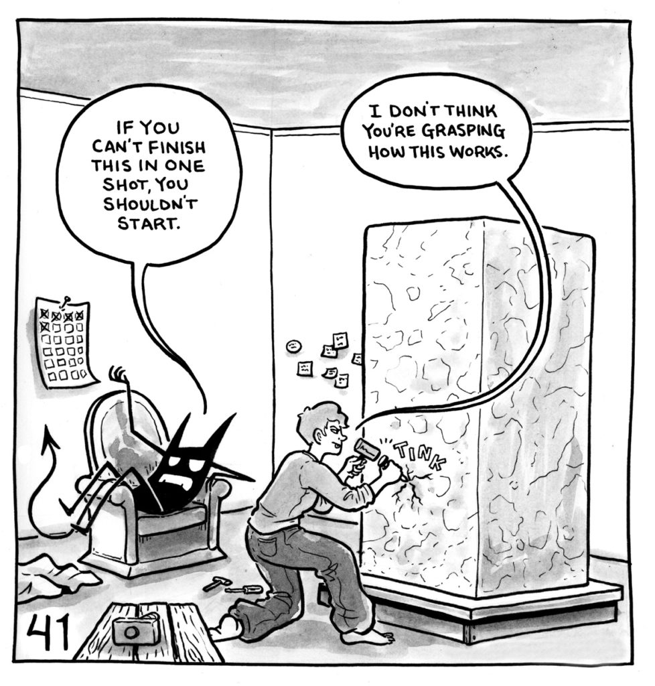
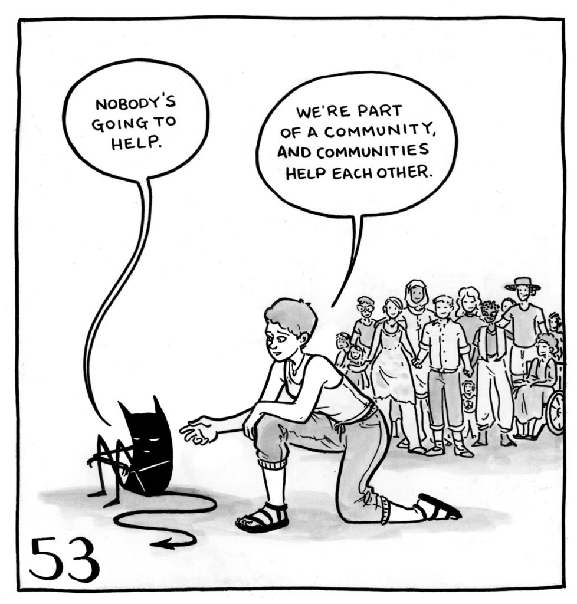

background-image: url(images/FF22SponsorSlide.png)
background-size: cover

???

# Welcome to DevFest WI and Forward Fest!

- Background images don't appear to scale correctly unless I also apply "background-size: cover" to the slide.-
---
class: title, smokescreen, shelf, no-footer
background-image: url(images/noideadog.jpg)

# Impostor Syndrome and Advocacy
## Getting from "I have no idea what I'm doing" to Advocating for others

???

Welcome! Thanks again to Jen for her talk on tracking your impact and announcing your accomplishments!

---
# Slides and Session Information

.qrcode.db.fr.w-40pct.ml-4[]

- General session info available at https://rosslarson.com/talks/
- Slides are at https://rosslarson.com/slides/ or just use the QR code
- Ask questions anytime

???

Here's a QR Code if you want to follow along on your laptop or phone.
Ask questions anytime.

---
background-image: url(gs/01-impostors.png)
background-size: cover

???

# What do these four characters have in common? (Mulan, Valjean, Aladdin, Daniel Hillard)

- Background images don't appear to scale correctly unless I also apply "background-size: cover" to the slide.-
---
background-image: url(gs/02-impostors.png)
background-size: cover

???

# They’re all impostors.

- (Ping, Monsieur Maire, Prince Ali, Mrs. Doubtfire) Our fiction is full of them.  (Dexter, 21 Jump Street, Pysch, Kindergarten Cop) In fiction, it’s fun to watch an impostor, but it isn’t fun to be one.
---
class: img-left
# About Me

- Software Developer at Paradigm
- Psychology/French major - Luther College 
- Admin, [Madison, WI Slack](http://madisoncommunity.org/)
- Father
- Survivor
- Impostor

@rosslarsonWI

hello@rosslarson.com

???

Hi. I'm Ross.

I'm a father, a gamer, a sports fan, a geek, a survivor, and an impostor.

Here’s my story.  School.  Call Center. 2009. FVTC. Farming Cooperative.
I’ve been paid to code in eight languages, give or take (Java, Javascript, Visual FoxPro, VB/Access, ABAP, PHP, C#, Python).
---
class: img-caption

# Impostor Syndrome in Psychology

???

You’ve heard my story, let’s look at the psychology.
---
background-image: url(images/psych-word-brain-cloud.jpg)
background-size: stretch

???

OK, quick course in Psychology.  I studied it for four years.  PhD’s study for about a decade or so.  I’m going to give you some basics in like 5 minutes.
---
class: title

# Clinical Signficiance

???

# Clinical Significance

The threshold under which treatment should be considered.  

- Work
- Life
- Relationships

Example, anxiety versus a clinical anxiety disorder.

---
class: title, fogscreen, shelf, no-footer
background-image: url(images/whynotboth.webp)
background-size: cover

# Comorbidity

???

# Comorbidity
Either a condition existing simultaneously but independently with another condition or a related medical condition. 
(Anxiety and Depression, ADD and Depression, etc.)

---
class: title

# The Stigma of Mental Health

???

Even before the pandemic (1999) the U.S. Surgeon General labeled stigma as perhaps the biggest barrier to mental health care; many people feat that admitting their issues will isolate them.

Many are scared to talk about it. Only 41% of people with a mental disorder get professional help. 

Help is available, but because we aren’t talking about mental health openly, and we don’t put the time in to educate ourselves about resources, people don’t get what they need. So they stay sick, and suffer unnecessarily.

About 1 in 5 in tech are currently dealing with a mental health issue right now.
---

class: title

# Pills vs. Skills

???

Treatment for psychological issues falls into two varieties.  Pills and skills.
- Pills = drugs.  
- Skills = 
    - Behavioral therapy
    - Group therapy
    - Coping mechanisms, 
    - Counseling, 
    - Self-care.
---

class: title

# Self-Care
## (it's not selfish)

???

# Self-care behaviors: 
- Mediation
- Diet
- Fitness
- Hygiene
- Monitoring
- Mindfulness

Having trouble?  There’s a website:  http://youfeellikeshit.com/ 

http://philome.la/jace_harr/you-feel-like-shit-an-interactive-self-care-guide/play

---
class: title

# Cognitive Bias

???

A cognitive bias refers to the systematic pattern of deviation from norm or rationality in judgment, whereby inferences about other people and situations may be drawn in an illogical fashion

---
class: title

# Metacognition

???

Metacognition is thought processes and an understanding of the patterns behind them.

Some types of metacognitive knowledge would include:

- Content knowledge (declarative knowledge) which is understanding one's own capabilities, such as a student evaluating their own knowledge of a subject in a class. 

- Task knowledge (procedural knowledge), which is how one perceives the difficulty of a task which is the content, length, and the type of assignment. 

- Strategic knowledge (conditional knowledge) which is one's own capability for using strategies to learn information. 

---
class: title

# The Dunning - Kruger effect

???

The Dunning-Kruger Effect was described by David Dunning and Justin Kruger in 1999.

The Dunning–Kruger effect is a cognitive bias wherein persons of low ability suffer from [illusory superiority](https://en.wikipedia.org/wiki/Illusory_superiority), mistakenly assessing their ability as greater than it is. They lack the metacognitive ability to recognize their own ineptitude. 
---
class: title

# The Curse of Knowledge
## A form of cognitive bias.

???

However, the inverse is also true. There is a external misperception in people of high ability; 

"the miscalibration of the incompetent stems from an error about the self, whereas the miscalibration of the highly competent stems from an error about others."[1](https://en.wikipedia.org/wiki/Dunning%E2%80%93Kruger_effect#cite_note-Kruger-1) 

Hence, the corollary to the Dunning–Kruger effect indicates that persons of high ability tend to underestimate their relative competence, and erroneously presume that tasks that are easy for them to perform also are easy for other people to perform.[1]

This is sometimes called the [Curse of Knowledge](https://en.wikipedia.org/wiki/Curse_of_knowledge), a form of Cognitive Bias.
---
class: title

# OK, OK.
## Now, some info about Impostor Syndrome.

???

Take a deep breath.  We've set the foundation. Now, I'm gonig to talk more directly about the psychology of Impostor Syndrome.
---
class: img-right-full

# Impostor Phenomenon
## 1978
- Pauline Rose Clance, PhD
- Suzanne Imes, PhD

???

Impostor Syndrome was first coined in 1978. It was discovered in high-achieving women unable to internalize accomplishments, thinking themselves to be frauds despite external validation to the contrary.  The research was also published in a self-help book in 1985.

Later research revealed it to be present in males as well as females, and in a variety of professions.
---

# Wait, Impostor *Phenomenon*?

- Phenomenon
- Syndrome
- Disorder
- Experience

???

- *Phenomenon:* a fact or situation that is observed to exist or happen, especially one whose cause or explanation is in question.
- What we call Impostor Syndrome was originally called “Impostor Phenomenon”
- Syndrome: a group of symptoms that consistently occur together or a condition characterized by a set of associated symptoms. A characteristic combination of opinions, emotions, or behavior.
- Impostor Syndrome has a commonly accepted group of symptoms
- Disorder: a disruption of normal physical or mental functions; a disease or abnormal condition.
- Impostor Syndrome may coexist with an Anxiety Disorder or Depressive Disorder, which may require treatment.
- Experience: an event or occurrence that leaves an impression on someone

Psychologists have been advocating for the use of the term “Impostor Experience” to 
communicate how common these feelings are, and the effects that they have on people.

---
background-image: url(images/clance-IPscale.png)
background-size: cover

???

The Clance Impostor Phenomenon Test is available [online](https://paulineroseclance.com/pdf/IPTestandscoring.pdf).  There are 20 questions and it is self-scored.

After taking the Impostor Test, add together the numbers of the responses to each statement.

- Score is 40 or less = few Impostor characteristics
- Score is between 41 and 60 =  moderate IP experiences
- Score between 61 and 80 = frequently has Impostor feelings
- Score higher than 80 = often has intense IP experiences. 

The higher the score, the more frequently and seriously the Impostor Phenomenon interferes in a person’s life.

---
background-image: url(images/impostor-cycle.png)
background-size: stretch

???

This is the Impostor Cycle
---
background-image: url(images/comic-GemmaCorrell.jpg)
background-size: stretch

???

Here's another way of explaining the chart.  
It shows of the feeling of the "no win situation".
Thanks to Gemma Correll for the comic.
---
background-image: url(gs/03-impostors.png)
background-size: stretch

???

Some famous impostors include: 
- Oscar winner and Harvard grad Natalie Portman
- Oscar winner Tom Hanks
- Supreme Court Justice Sonia Sotomayor
- Comedian and best selling author Tina Fey
- Brown University Graduate/actress/model/activist Emma Watson
- Best-Selling Author Neil Gaiman…….
---
background-image: url(gs/04-impostors.png)
background-size: stretch

???

You will find people with impostor syndrome in graduate students and scientists…….

---
background-image: url(gs/05-impostors.png)
background-size: stretch

???

You'll even find it in Roller Derby.  Some statistics now say that up to 70% of us will experience Impostor Syndrome at some point in our lives.
- [Roller derby and tenure tracks](https://blogs.scientificamerican.com/context-and-variation/survival-on-the-roller-derby-and-tenure-tracks/)
- [Reddit thread on roller derby and impostor syndrome](https://www.reddit.com/r/rollerderby/comments/4aspt0/dealing_with_imposter_syndrome_in_derby_and_how/)

---
class: img-caption

# Impostor Syndrome In Tech

???

All right, let’s look at Impostor Syndrome in tech.

---

# “To be an engineer you need:
## 1) A willingness to feel totally lost

## 2) The confidence that you will eventually reach the solution”

**@michellewetzler**

Sr. Director, Head of Services Delivery at @twilio

???

Are we worried about making mistakes?
[Original tweet](https://twitter.com/michellewetzler/status/854449147063054336)

---
background-image: url(images/tetris.jpg)
background-size: cover

???

The way that most of us do work, we’re surrounded by:
- The stuff that has broken or 
- the stuff that hasn’t yet been finished.  

People don’t usually pay us to look at our successes.

---

background-image: url(images/whiteboard-interview.png)
background-size: cover

???

How we get hired can influence our feelings of being an Impostor.  

You may feel like you got lucky if you get hired, and you might feel completely useless if you don't. Hiring results aren’t always clear, other than “you’re hired”.
---

# "I am a 10X developer. 
## Everything I do takes ten times as long as I thought."
**@discostu105**

???

Behold, the myth of the 10X developer.
[tweet](https://twitter.com/discostu105/status/876901601277030403)

---
class: img-right

# Programming tutorials

- Download this framework
- Open in IDE
- View our "Hello World" example
- Change code to "Hello, Ross"
- Add auth, business logic, integrate it into other legacy systems, deploy into k8s and make it an enterprise cloud app!

???

Sometimes, Finding the solution from available information can feel frustrating, like this instructional guide to [drawing a horse](http://oktop.tumblr.com/post/15352780846).

Sometimes Impostor Syndrome may be a symptom of organizational ineffectiveness - putting a new employee where they aren't in the position to succeed, or not clearly indicating the expectations that they have.

---
class: title, smokescreen, shelf, no-footer
background-image: url(images/slides-single.png)

# “We are all apprentices 
## in a craft where no one ever becomes a master.” - Ernest Hemingway

???

“We are all apprentices in a craft where no one ever becomes a master.”
Ernest Hemingway

Software Development moves at an astoundingly fast rate.  

It’s easy to feel under-informed and out of place.

---
class: img-left

# The struggle

We won't always have the answers.

(Image courtesy of 100 Demon Dialogues, by Lucy Bellwood)

???

In tech, the struggle for knowledge is the job, and we need to be comfortable with ourselves not having all of the answers through the process.
---
class: img-left

# Community

We're here to help each other.

(Image courtesy of 100 Demon Dialogues, by Lucy Bellwood)

???

It may seem bleak, but we’re a community, and communities help each other.
---

class: title

# Comparing our experiences

???

One thing that’s helped me deal with Impostor Syndrome is trying to use empathy for others to get me outside of just thinking about myself.

---
background-image: url(gs/06-impostors.png)
background-size: cover

???

Show of hands.  
- Raise your hand if you’ve ever been in a group of more than five people where you were the only person of your gender expression, race, or nationality.  
- Raise your hand if that group was at work.  
- Raise your hand if that group was a job interview.

If your hand isn't raised, think about how these situations may feel.

---
class: img-caption

# Microaggressions: "How It Works" (XKCD #385)

???

When I’m doing a whiteboard interview, I’m worried that I'll look like an idiot.  
When some women or minorities are at the whiteboard, they worry that any mistake they make will be an excuse only to interview white dudes in the future.

---
background-image: url(gs/07-impostors.png)
background-size: cover

???

OK, what am I afraid of when I look at my github profile?  I worry that people will see so much white space and think that I’m a bad coder.

---
background-image: url(gs/08-impostors.png)
background-size: cover

???

Has someone ever hit on you via github?  
- [Michelle](https://twitter.com/mishmosh) studied human-computer interaction at Stanford. 
- She invented Google Forms.  
- She worked at Google for 6 years (2005-2011).  
- But.... She had her email and a headshot on her GitHub profile.  
- When someone saw her profile, they sent this email. 
- Have you ever been propositioned via GitHub?

I've never had to worry about this.
[original mishmosh tweet](https://twitter.com/mishmosh/status/880450207124729859)
---

---
class: img-caption

# Questions? Thoughts?

???

# Any Questions?

---
background-image: url(images/bow-thank-you.webp)
background-size: stretch

# Thanks!

???

# Thanks!
---
 ### Credits

- The "I have no idea what I'm doing" dog is Bailey the Golden Retriever. Courtesy of Redditor [Golden_Bailey](https://www.reddit.com/user/Golden_Bailey/?sort=top). History of meme is [here](https://knowyourmeme.com/memes/i-have-no-idea-what-im-doing).
- Pictures of movie impostors are from their respective studios.  Please consider this fair use and don't sue me.
- Person inside of person's head image courtesy of [http://psychlearningcurve.org](http://psychlearningcurve.org/increasing-community-awareness-of-the-value-of-psychology-skills/)
- Psychology word cloud courtesy of [studiousguy.com](https://studiousguy.com/psychology/)
- Why not both meme courtesy of Old El Paso Commercial. Relevant meme [here](https://knowyourmeme.com/memes/why-not-both-why-dont-we-have-both).
- Rest/Get Work done image is from Gemma Correll, via [Twitter](https://twitter.com/gemmacorrell/status/1453822136540299265/photo/1)
- Circuit board head is from "The Rise of Cyberpsycholopgy from [King University Online](https://online.king.edu/news/cyberpsychology/).
- Whiteboard Interview image is courtesy of [Tatiana Ensslin](https://medium.com/@tatianaensslin) from "Overcoming the whiteboarding interview jitters" on [medium](https://medium.com/girl-develop-it-san-francisco/overcoming-the-whiteboarding-interview-jitters-b3f806dbe12b).
- How to draw a horse courtesy of [Van Oktop](http://oktop.tumblr.com/post/15352780846).
- "Feelings Thoughts" gif courtesy of Chuber Channel via [giphy](https://giphy.com/gifs/chuber-feelings-thoughts-questions-XHVmD4RyXgSjd8aUMb)
- "Bow Thank You" gif courtesy of Out of Office via [giphy](https://giphy.com/gifs/3ZZD9fwwaI8u7hQe1P)

