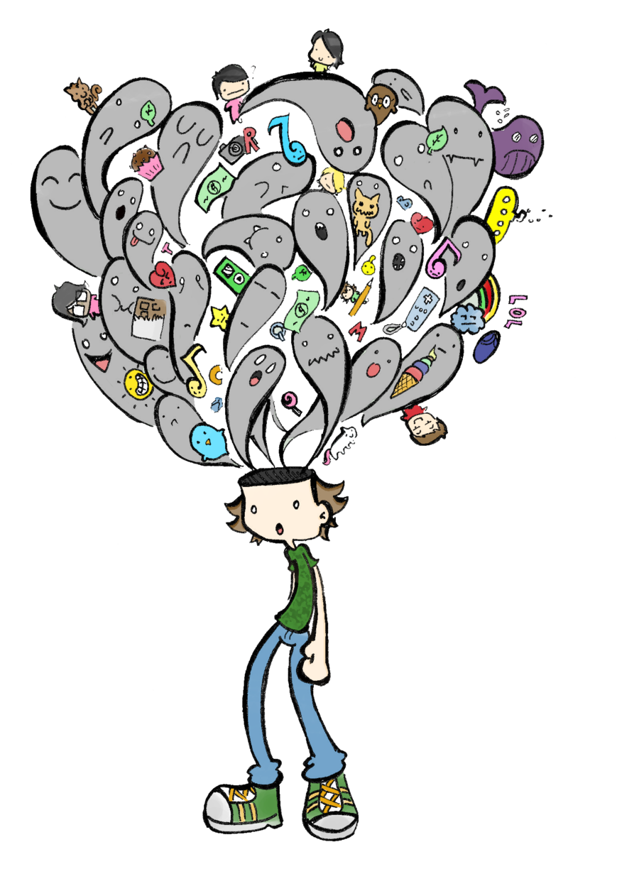

background-image: url(images/iStock_meditateDesk.jpg)
background-size: cover

???

# Mindfulness at Work! Image slide.

- Background images don't appear to scale correctly unless I also apply "background-size: cover" to the slide.
- Press C to open a new linked window, and press P to view presenter notes.
- F11 to go into borderless mode on Windows
- ctrl + cmd + F should be borderless mode in Mac
---
class: title, smokescreen, shelf, no-footer
background-image: url(images/iStock_meditateDesk.jpg)

# Mindfulness at Work: 

## A Practical Guide to the Wellness Wheel

???

I think that this picture is ridiculous, but I wanted to share it.
---
class: img-left
# About Me

- Software Developer at Paradigm
- Luther College Alumnus - Psychology / French majors
- Forward Fest Board Member
- Admin, Madison, WI Slack
- Forward Madison FC Fan
- Survivor

@rosslarsonWI

hello@rosslarson.com

???

Hi. I'm Ross.
---
# Slides

.qrcode.db.fr.w-40pct.ml-4[]

Slides are at https://rosslarson.com/slides/ or you can scan the QR code.

- Ask questions anytime

---
class: img-left
# Agenda

- Mindfulness
- The RAIN method
- The Wellness Wheel
- Self-assessment
- A roadmap to an experimental mindset

???

Today, we will:
- Get an introduction to mindfulness and the RAIN method.
- A description of the Wellness Wheel and an overview of the dimensions of wellness
- A self-assessment to help give you a snapshot of your current status
- A roadmap to an experimental mindset
- And.... Leave with no problems!

---
class: img-right
# Fist of Five voting

How familiar are you with:

- Mindfulness
- The Wellness Wheel
- SMART Goals

???

Before we get too far into things, I'd like to get some fist of five votes from the crowd.
I'm going to use these votes to help understand the level of detail in my introductions.

From fist to five, how familiar are you with:
- Mindfulness
- The Wellness Wheel
- SMART Goals

---
class: roomy, img-left
 # What is Mindfulness?

- Present Moment Awareness
- Non-Judgmental Acceptance
- Focus
- Observation
- Self-Regulation

???

Present Moment Awareness: 
- Being fully engaged in what you're doing, sensing, and feeling
- Here and now 
- Not letting your mind wander.

Non-Judgmental Acceptance: 
- Observe your experiences without labeling them as good or bad, right or wrong.
- This allows for a sense of calm 
- Helps you avoid getting swept away by negative emotions.

Focus: 
- Bringing attention to a particular object, such as:
- Breath, Bodily Sensations, or the Sounds around you.

Observing Thoughts and Emotions:
- Acknowledge the presence of thoughts and emotions 
- Observe them as they arise and pass, like clouds drifting across the sky.

Self-Regulation: 
- Learning to guide your attention back to the present when your mind inevitably wanders
---
class: img-left
# What ISN'T Mindfulness?

- One specific method
- A quick fix
- Buddhism
- Pro- or Anti-religion
- Emotional suppression
- Floating in the air

???

So, what isn't mindfulness?
- It's not one specific method, like meditation
- It's not a quick fix that you do once and change your life forever
- Some of the origins of mindfulness are rooted in Buddhism, but mindfulness is not specifically or only Buddhist
- You can be religious or non-religious and practice mindfulness. It can coexist with your existing practices.
- You're not just suppressing or escaping your thoughts and emotions. You're still allowed to have feelings.
- You don't suddenly start floating if you do it right. It may feel awkward the first few times you do it, but it's worth it to keep going. You may already be doing some of the practices!
---
class: img-caption
# The River and The Riverbank

???

The best way I've found to understand mindfulness is thinking about it this way:

- The mind is like a river, constantly flowing with thoughts, sensations, and emotions. 
- Just as the water in a river is always changing, our thoughts and feelings are not permanent and are constantly shifting. 

- Instead of always being in the middle of the river,
- Step back and observe the "river" of their mind from a place of detachment, like standing on the riverbank. 
- By observing the thoughts as they pass, you can cultivate a sense of inner peace and reduce identification with negative or overwhelming thoughts. 

---
class: img-right
# Ways to be mindful!

- Formal practices
 - Meditation
 - Yoga
 - Guided exercises
 - 5-4-3-2-1

- Informal practices
 - Mindful eating, listening, walking
 - Journaling
 - Doodling

???

 # There are a variety of ways to be mindful.
 Generally, there's two categories- Formal and informal practices.
 - That basically describes how much structure there is to the activity.
---
background-image: url(images/mindfulness-quadrants.png)
background-size: cover

???

# Mindfulness quadrants

Given the number of different ways to express mindfulness, and because I like charts, I decided to make a chart to help organize activities based on:
- How informal / formal the activity is
- How much technology is involved.

This is a busy slide, so I'm going to explain each quadrant individually.

---
class: img-caption
# Informal / Low Tech

???

Informal / Low Tech - You could do this stuff in the 1800s:
- Walks, journaling, being aware of the world around you

---
class: img-caption
# Informal / High Tech

???

Informal / High Tech - Technology is involved but not providing structure:
- Listening to music to be contemplative
- Long-play youtube videos (like a 4 hour train ride in Norway in the snow)
- Playing a game like "Sprit City: Lofi Sessions" that plays lofi music and encourages you to chill or journal

---
class: img-caption
# Formal / Low Tech

???

Formal / Low Tech - Structured, but not linked to Tech
- Formal meditation
- Yoga
- Guided exercises like 5-4-3-2-1, RAIN, and Body Scans
 - 5-4-3-2-1 See/Hear/Touch/Smell/Taste

---
class: img-caption
# Formal / High Tech

???

Formal / High Tech - Structured, facilitated by technology
- Calm mobile app
- Headspace mobile app
- PLAYNE / INWARD - mediation facilitation video games on Steam 
- VR? 
---
class: roomy, img-left-full

# The RAIN Method

- Recognize
- Allow
- Investigate
- Nurture

???

The Rain method was created by Dr. (TARR-uh BROCK) Tara Brach

The acronym RAIN is an easy-to-remember tool for practicing mindfulness and compassion using the following four steps:

- Recognize what is happening;
- Allow the experience to be there, just as it is;
- Investigate with interest and care;
- Nurture with self-compassion.

It's a way to take a frustrating work scenario, allow yourself to process the feelings and situations.

You can do this on your own, or find a guided mindfulness video about it on Youtube. Either way is fine.
---
class: img-caption
# Wellness

???
# Wellness
Moving on, let's discuss wellness.... and wheels.

The roots come from religious and cultural practice, but we've come a long way from there.
---
background-image: url(images/wheels/ww3.png)
background-size: cover

???

Buddhism does not regard the body and the mind or spirit as being two entirely separate entities. The body and mind or spirit combine and interact in a complex way to constitute an individual.
---
background-image: url(images/wheels/ww4.png)
background-size: cover

???

Some Native American cultures have a wholistic model guided by the medicine wheel:
- Mental
- Emotional
- Physical
- Spiritual well-being.

---
background-image: url(images/wheels/ww6.png)
background-size: cover

???

Dr. Bill Hettler is often credited with creating the first widely adopted version of the Wellness Wheel in the late 1970s.
- Other wellness experts have expanded upon Dr. Hettler's original model of 6 aspects
- If you feel like you've seen a lot of different wellness wheels, it's probably because you have.
---
background-image: url(images/wheels/ww7.png)
background-size: cover

???

7 aspects
---
background-image: url(images/wheels/ww8.png)
background-size: cover

???

8 aspects
---
background-image: url(images/wheels/ww9.png)
background-size: cover

???

9 aspects
---
background-image: url(images/wheels/ww10.png)
background-size: cover

???

10 aspects - This is from LSU and it's interesting that sexual wellness is its own aspect.
---
background-image: url(images/wheels/ww12.png)
background-size: cover

???

12 aspects

I'm not entirely sure that "Home Cooking" deserves its own wellness slice, but I think we can all agree that some of these aspects of wellness are a bit arbitrary, and that our view of wellness may evolve over time.
---
background-image: url(images/wheels/ww8-unh.png)
background-size: cover

???

In the meantime, I'm going to use the Wellness Wheel from the University of New Hampshire, and explain those aspects. I'll explain my reasoning for choosing this wheel shortly.
---
class: img-right
# 8 Aspects of Wellness

- Social
- Financial
- Physical
- Emotional
- Spiritual
- Intellectual
- Environmental
- Occupational

???

- Social
 - Feeling supported in healthy, close relationships with family and friends
- Financial
 - Living within your means and balancing spending in the present and the future
- Physical
 - Physical activity, healthy diet, good sleep, etc.
- Emotional
 - Feeling good about yourself, recognizing your stress/anxiety, asking for help, feeling comfortable with saying "no"
- Spiritual
 - Sense of meaning and purpose, clear sense of right/wrong, compassion and goodwill
- Intellectual
 - Curiosity, openness to new ideas, critical thinking, learning new things
- Environmental
 - Spending time in nature, keeping a good home/work environment, green living
- Occupational
 - Having goals and finding purpose in work, using your skills effectively, healthy work/life balance
---
class: img-left
# Wellness Quiz!

Scan the QR code or take the quiz at https://unhextension.datahubs.org/

- 5 : I am extremely satisfied
- 4 : I am very satisfied but can do a bit more
- 3 : I feel satisfied but can make some improvements
- 2 : I am very unsatisfied and need to prioritize
- 1 : I am extremely unsatisfied and need to take actionable steps to improve

???

Let's take a wellness quiz!
- This Wellness Wheel Assessment was created by Michelle Kroll, PhD. for the University of New Hampshire extension, but anyone can take it! Let's take advantage of that.
- It asks for demographic information at the end, but you can opt out of that if you don't feel comfortable.
- Let me know if you have any issues accessing the quiz.
---
background-image: url(images/wheels/ww8-unh.png)
background-size: cover

???

Now that we've taken this quiz again, let's take another look at the wellness wheel.
- First of all, I want to communicate that perfection on the wheel is impossible, and that's OK.
- That being said, were there any surprises? Did it bring up any questions?

---
background-image: url(images/NewYearOprah.png)
background-size: cover
???

This quote by Oprah seems to capture the fact that our society seems to express that the only acceptable time to think about ourselves and to make goals is:
- On either New Year's Eve or New Year's Day, 
- probably while either drunk or hungover.  
- I think that's bullshit.
- Spending a day setting goals and then a year living your life is a recipe for failure every year.
- Society tells us over and over that we are broken and not enough, and then tries to sell us a quick fix, or a momentary distraction. 
- We are capable of thinking more clearly and acting with more purpose than that.
- We can be more mindful about our careers and lives than that.
---
class: img-caption
# 

???

- You now have an overall idea of your wellness
- Maybe, you want to make some changes.
- SMART goals are one way.

1. Specific: Clearly define what you want to achieve. Avoid vague statements. 
2. Measurable: How will you track progress and know when you've achieved the goal? 
3. Achievable: Ensure the goal is realistic and attainable given your resources and circumstances. 
4. Relevant: Ensure the goal aligns with your overall objectives and priorities. 
5. Time-bound: Set a deadline for achieving the goal

Personally, I've had pretty good luck with setting one or two SMART goals, but I often forget to set new ones.
---
background-image: url(images/atomic-habits-fullscreen.jpg)
background-size: cover
???

- Another way to think about change is in terms of habits.
- Atomic Habits by James Clear could easily be its own presentation, but I wanted to put forth two points about the book:
- Small changes compound into large results over time
- The best way to create behavior change is to integrate it into your identity, meaning who you tell yourself that you are will eventually be who you are.
---
class: img-left-full

# An Alternative: The Half-Year (August) Reset!
- A combination of tools!
- Clear your mind
- Recognize your previous goals and results
- Assess your successes and failures
- Create an ideal scenario and order your goals
- Envision your success and create systems

???
SMART Goals are and Atomic Habits are great, but with the tools we have, we might be able to go further.
- Author, Illustrator, and YouTuber Campbell Walker (AKA struthless) created a workbook that you could use.
- It's half mindfulness exercise, half goal setting.
- I have some copies available, and a link to the worksheet is available. We're not going to go through this whole exercise, but I'd like to show you the steps.
- If you forget what I have to say about it, he has a youtube video that describes it, so I'd suggest checking that out.
---
background-image: url(images/reset-emptyheadQR.png)
background-size: cover
???

# Empty your head
- Here's the QR code to this PDF if that's useful to you.
- The first part of the half year reset is an activity to clear your mind through unstructured journaling. If you feel like one of the other structured or unstructured mindfulness exercises works to help with that, feel free. 
---
background-image: url(images/reset-step2-4.png)
background-size: cover
???
# Remember your goals versus reality
- Think about what you wanted 6 months ago, or at the beginning of the year.
- Write down what actually happened.
 - Extenuating circumstances happen. My mom died in March. Some things happen that we can't plan for.
 - This isn't to make ourselves feel bad, just to be honest and non-judgemental.
- Next, we think about why some goals succeeded, and some failed.
 - Sometimes the reasons can help us understand the results.
 - In the places where you succeeded, take the win! It's OK to be proud of success.
---
background-image: url(images/reset-step5-8.png)
background-size: cover
???
# What are the ideal outcomes? Why?
- Find your ideal scenario of how you want the rest of the year to go.
 - What things do you want to happen and why?
- Next take your ideal scenario and rank the goals by importance.
 - Some goals will be more important, and that's OK
 - When time is limited, this will help you focus on the most important things.
# Identity and goals.
- Who do you need to be to accomplish your goals? 
 - What would you need to believe about yourself?
 - What would you need to do more?
 - What would you need to do less?
 - Write down some ideas, and see if you can shorten it into a sentence.
- Create a system to realistically hit your goals over the next 6 months.
 - "You do not rise to the level of your goals, you fall to the level of your habits".
 - Here's where the atomic habits and SMART goals come back in.
 - Plan for average and rough days, not just the best-case scenario.
---
background-image: url(images/reset-step9-11.png)
background-size: cover
???
# Planning for tough times
- What will you do when things get tough?
 - Prepare for difficult times. What systems, rewards, and tactics might you need?
 - Remember, you're allowed to bribe yourself with things you love to get results!
- Why do you deserve this?
 - I think you guys are great, but my words can't be the only ones that you use to create change.
 - You deserve a life with meaning and happiness. Find the reasons and words that help you get there.
- Take action
 - Turn this desire into action, and create momentum for yourself!

---
class: roomy, img-right-full

# Conclusion

- We are full of thoughts and feelings
- Know the tools to be mindful
- Be aware of different wellness aspects
- Work toward:
 - Loving the life you live 
 - Living the life you love.

???

- You and I are full of a lot of different thoughts and feelings.
- Those thoughts and feelings follow us in and out of our work
- I hope that I've given you some tools
 - To find calm in the storm
 - To experience life at the riverbank
- To make yourself a more balanced, healthy person and employee.
---
class:img-caption
# Questions?

???
I wanted to leave some extra time here for questions because:
- It's important to know what's important to you
- I want to help you where you're at
- I've been in my own head about this for a while, so I'd love to hear your perspectives.
- Please let me know if you have questions about any of this material.
---
class: img-right-full

# Thanks!

Slides are at:

https://rosslarson.com/slides/

Additional resource links at:
https://rosslarson.com/talks/

- @rosslarsonWI

- hello@rosslarson.com

???

Thanks for coming!

Let me know if you want more information.
---
class:compact
 ### Image Credits
- Ridiculous image of meditating folks from iStock.
- Cartoon headshot of me was a commission from [Reverent Geek](https://reverentgeek.com/)
- Checklist image from [pngegg](https://www.pngegg.com/en/png-tukaa)
- Fist of Five image from [MeetingNotes.com](https://meetingnotes.com/blog/fist-to-five-voting)
- Brain image from [pngegg](https://www.pngegg.com/en/png-zkjjn)
- Head with colors coming out image from [pngegg](https://www.pngegg.com/en/png-bazwi)
- Image of waterfall from Embarrass river taken by Ross Larson in Pella, WI
- 12 ways to practice mindfulness from [Kate Hadfeld and Sarah Pecorino](https://www.thepathway2success.com/12-simple-ways-to-practice-mindfulness/)
- Mindfulness quadrants created by Ross Larson, using images from multiple sources:
 - [thepathway2success.com](https://www.thepathway2success.com/12-simple-ways-to-practice-mindfulness/)
 - [PLAYNE](https://www.playne.co/) / [INWARD](https://store.steampowered.com/app/1545430/Inward/) / [Calm](https://www.calm.com/) / [Headspace](https://www.headspace.com/) 
 - [Spirit City: Lofi Sessions](https://mooncubegames.com/#spiritcity)
 - Mindfulness practices from [Simply Psychology](https://www.simplypsychology.org/what-is-mindfulness.html)
 - Norway Train screenshot from [RailCowGirl on Youtube](https://www.youtube.com/@RailCowGirl)
- RAIN cover from [Dr. Tara Brach](https://www.tarabrach.com/rain/)

---
class:compact
 ### Image Credits, continued
- Wellness image from the [Universities of Wisconsin](https://flex.wisconsin.edu/wellbeing-wellness/)
- 3 aspects image from [Stephen J. Costello](https://www.cambridgescholars.com/product/978-1-5275-8882-0)
- 4 aspects image from [Courtney Pennell](https://www.dal.ca/faculty/health/news-events/news/2025/04/21/courtney_pennell_lighting_the_path.html)
- 6 aspects image from [Manna Project](https://www.mannaproject.org/usblog/2020/12/7/the-dimensions-of-wellness)
- 7 aspects image from [ClassPass](https://classpass.com/blog/how-to-create-a-wellness-wheel/)
- 8 aspects image from [Vanderbilt University](https://news.vumc.org/2024/09/18/nurse-wellness-website-relaunched/)
- 9 aspects image from [Soha Wellness](https://sohawellness.com/the-wellness-wheel-a-practical-tool-for-a-better-life/)
- 10 aspects image from [LSU](https://www.lsu.edu/student-affairs/wellness.php)
- 12 aspects image from [Colleen Kachmann](https://www.colleenkachmann.com/health-coaching-tools-the-wellness-wheel/)
- UNH wellness wheel courtesy of the [University of New Hampshire Extension](https://extension.unh.edu/health-well-being/programs/wellness-wheel-assessment)
- Head with arrows image from [pngegg](https://www.pngegg.com/en/png-ymmrv)
- Oprah quote about the New Year from [pngegg](https://www.pngegg.com/en/png-xqwcl)
- SMART Goals from [pngegg](https://www.pngegg.com/en/png-iuncz)
- Atomic habits picture from [James Clear](https://jamesclear.com/atomic-habits)
- Half-Year Reset cover and pages from [Campbell Walker](https://drive.google.com/file/d/1qXPd2333U9VPdG5gfOUaq-JdTpJuVfhY/view)
- Mind bubbles from [pngegg](https://www.pngegg.com/en/png-yhdqe)

---
class:compact
 ### Image Credits, continued
- Question marks from [pngegg](https://www.pngegg.com/en/png-bwrce)
- Picture of me is from DevFest WI 2023 at the UW Madison Memorial Union.