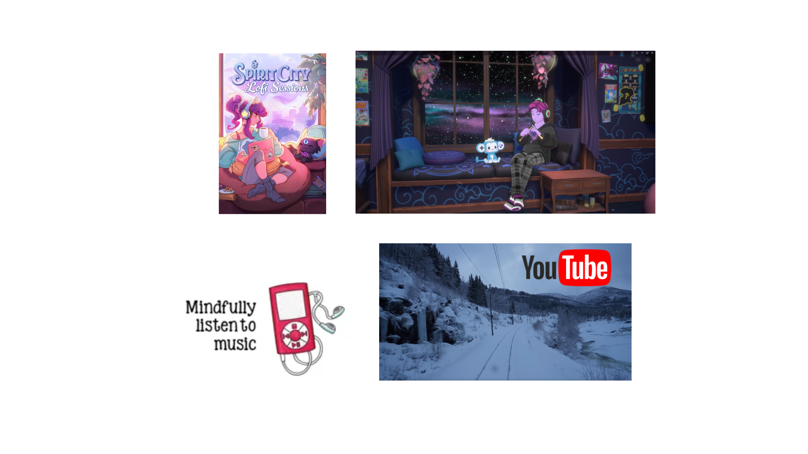
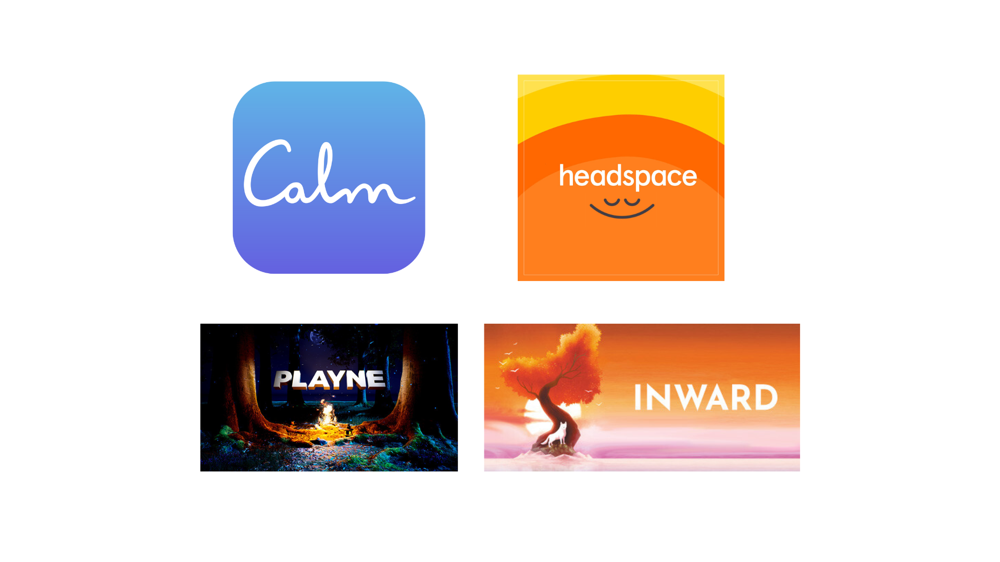

background-image: url(images/iStock_meditateDesk.jpg)
background-size: cover

???

# Mindfulness at Work! Image slide.

- Background images don't appear to scale correctly unless I also apply "background-size: cover" to the slide.
- Press C to open a new linked window, and press P to view presenter notes.

---
class: title, smokescreen, shelf, no-footer
background-image: url(images/iStock_meditateDesk.jpg)

# Mindfulness at Work: 

## A Practical Guide to the Wellness Wheel

???

Make sure you're in the right room! Which is funny, since there's only one room where talks are happening.

---
class: img-left
# About Me

- Software Developer at Paradigm
- Luther College Alumnus - Psychology / French majors
- Forward Fest Board Member
- Admin, Madison, WI Slack
- Forward Madison FC Fan
- Survivor

@rosslarsonWI

hello@rosslarson.com

???

Hi. I'm Ross.
---
# Slides

.qrcode.db.fr.w-40pct.ml-4[]

Slides are at https://rosslarson.com/slides/ or you can scan the QR code.

- Ask questions anytime

---
class: img-left
# Agenda

- Mindfulness
- The RAIN method
- The Wellness Wheel
- Self-assessment
- A roadmap to an experimental mindset

???

Today, we will:
- Get an introduction to mindfulness and the RAIN method.
- A description of the Wellness Wheel and an overview of the dimensions of wellness
- A self-assessment to help give you a snapshot of your current status
- A roadmap to an experimental mindset
- And.... Leave with no problems!

---
class: img-right
# Fist of Five voting

How familiar are you with:

- Mindfulness
- The Wellness Wheel
- SMART Goals

???

Before we get too far into things, I'd like to get some fist of five votes from the crowd.
I'm going to use these votes to help understand the level of detail in my introductions.

From fist to five, how familiar are you with:
- Mindfulness
- The Wellness Wheel
- SMART Goals

---
class: roomy, img-left
 # What is Mindfulness?

- Present Moment Awareness
- Non-Judgmental Acceptance
- Focus
- Observation
- Self-Regulation

???

Present Moment Awareness: 
- Being fully engaged in what you're doing, sensing, and feeling
- Here and now 
- Not letting your mind wander.

Non-Judgmental Acceptance: 
- Observe your experiences without labeling them as good or bad, right or wrong.
- This allows for a sense of calm 
- Helps you avoid getting swept away by negative emotions.

Focus: 
- Bringing attention to a particular object, such as:
- Breath, Bodily Sensations, or the Sounds around you.

Observing Thoughts and Emotions:
- Acknowledge the presence of thoughts and emotions 
- Observe them as they arise and pass, like clouds drifting across the sky.

Self-Regulation: 
- Learning to guide your attention back to the present when your mind inevitably wanders
---
class: img-left
# What ISN'T Mindfulness?

- One specific method
- A quick fix
- Buddhism
- Pro- or Anti-religion
- Emotional suppression
- Floating in the air

???

So, what isn't mindfulness?
- It's not one specific method, like meditation
- It's not a quick fix that you do once and change your life forever
- Some of the origins of mindfulness are rooted in Buddhism, but mindfulness is not specifically or only Buddhist
- You can be religious or non-religious and practice mindfulness. It can coexist with your existing practices.
- You're not just suppressing or escaping your thoughts and emotions. You're still allowed to have thoughts.
- You don't suddenly start floating if you do it right. It may feel awkward the first few times you do it, but it's worth it to keep going.
---
class: img-caption
# The River and  the River's Edge

???

The best way I've found to understand mindfulness is thinking about it this way:

Mindfulness River: 

Flowing Nature:
- The mind is like a river, constantly flowing with thoughts, sensations, and emotions. 

Transient Thoughts:
- Just as the water in a river is always changing, our thoughts and feelings are not permanent and are constantly shifting. 

Acceptance and Non-Judgment:
- A mindfulness practice that uses the "river" metaphor encourages acceptance of this flow without getting caught up in or judging the thoughts. 

Example:
Activities might involve simply observing the "river" of your mind, noticing the thoughts and feelings as they arise and pass away, without trying to control or change them, according to a Facebook group dedicated to mindful practices. 

River's Edge:

Observational Stance:
- This metaphor encourages the practitioner to step back and observe the "river" of their mind from a place of detachment, like standing on the riverbank. 

Non-Identification:
- The "river's edge" helps one recognize that thoughts and feelings are separate from oneself. You are not your thoughts, but rather the observer of your thoughts. 
Inner Peace:
- By observing the thoughts as they pass, practitioners can cultivate a sense of inner peace and reduce identification with negative or overwhelming thoughts. 

Example:
Guided meditations may involve visualizing thoughts as leaves floating on the river, allowing them to pass without engaging with them. 

In essence: The "river" metaphor emphasizes the continuous flow of experience, while the "river's edge" metaphor emphasizes the ability to observe that flow without being swept away by it.
---
class: img-right
# Ways to be mindful!

- Formal practices
 - Meditation
 - Yoga
 - Guided exercises
 - 5-4-3-2-1

- Informal practices
 - Mindful eating, listening, walking
 - Journaling
 - Doodling
---
background-image: url(images/mindfulness-quadrants.png)
background-size: cover

???

# Mindfulness quadrants

Given the number of different ways to express mindfulness, I decided to make a chart to help organize activities based on:
- How informal / formal the activity is
- How much technology is involved.

This is a busy slide, so I'm going to explain each quadrant individually.

---
class: img-caption
# Informal / Low Tech

???

Informal / Low Tech - You could do this stuff in the 1800s:
- Walks, journaling, being aware of the world around you

---
class: img-caption
# Informal / High Tech

???

Informal / High Tech - Technology is involved but not providing structure:
- Listening to music to be contemplative
- Long-play youtube videos (like a 4 hour train ride in Norway in the snow)
- Playing a game like "Sprit City: Lofi Sessions" that plays lofi music and encourages you to chill or journal

---
class: img-caption
# Formal / Low Tech

???

Formal / Low Tech - Structured, but not linked to Tech
- Formal meditation
- Yoga
- Guided exercises like 5-4-3-2-1, RAIN, and Body Scans
 - 5-4-3-2-1 See/Hear/Touch/Smell/Taste

---
class: img-caption
# Formal / High Tech

???

Formal / High Tech - Structured, facilitated by technology
- Calm mobile app
- Headspace mobile app
- PLAYNE / INWARD - mediation facilitation video games on Steam 
- VR? 
---
class: roomy, img-left-full

# The RAIN Method

- Recognize
- Allow
- Investigate
- Nurture

???

The Rain method was created by Dr. Tara Branch, PhD.

The acronym RAIN is an easy-to-remember tool for practicing mindfulness and compassion using the following four steps:

- Recognize what is happening;
- Allow the experience to be there, just as it is;
- Investigate with interest and care;
- Nurture with self-compassion.

It's a way to take a frustrating work scenario, allow yourself to process the feelings and situations.

You can do this on your own, or find a guided mindfulness video about it on Youtube. Either way is fine.
---
class: img-caption
# Wellness

???
# Wellness
Moving on, let's discuss wellness.... and wheels.
---
background-image: url(images/wheels/ww3.png)
background-size: cover

???

Buddhism does not regard the body and the mind or spirit as being two entirely separate entities. The body and mind or spirit combine and interact in a complex way to constitute an individual.
---
background-image: url(images/wheels/ww4.png)
background-size: cover

???

Some Native American cultures have a wholistic model guided by the medicine wheel:
- Mental
- Emotional
- Physical
- Spiritual well-being.

---
background-image: url(images/wheels/ww6.png)
background-size: cover

???

Dr. Bill Hettler is often credited with creating the first widely adopted version of the Wellness Wheel in the late 1970s.
- Other wellness experts have expanded upon Dr. Hettler's original model of 6 aspects
---
background-image: url(images/wheels/ww7.png)
background-size: cover

???

7 aspects
---
background-image: url(images/wheels/ww8.png)
background-size: cover

???

8 aspects
---
background-image: url(images/wheels/ww9.png)
background-size: cover

???

9 aspects
---
background-image: url(images/wheels/ww10.png)
background-size: cover

???

10 aspects
---
background-image: url(images/wheels/ww12.png)
background-size: cover

???

12 aspects
---
background-image: url(images/wheels/ww8-unh.png)
background-size: cover

???

I'm going to use the UNH Wellness Chart, and explain those aspects.
---
class: img-right
# 8 Aspects of Wellness

- Social
- Financial
- Physical
- Emotional
- Spiritual
- Intellectual
- Environmental
- Occupational

???

- Social
 - Feeling supported in healthy, close relationships with family and friends
- Financial
 - Living within your means and balancing spending in the present and the future
- Physical
 - Physical activity, healthy diet, good sleep, etc.
- Emotional
 - Feeling good about yourself, recognizing your stress/anxiety, asking for help, feeling comfortable with saying "no"
- Spiritual
 - Sense of meaning and purpose, clear sense of right/wrong, compassion and goodwill
- Intellectual
 - Curiosity, openness to new ideas, critical thinking, learning new things
- Environmental
 - Spending time in nature, keeping a good home/work environment, green living
- Occupational
 - Having goals and finding purpose in work, using your skills effectively, healthy work/life balance
---
class: img-left
# Wellness Quiz!

Scan the QR code or take the quiz at https://unhextension.datahubs.org/

- 5 : I am extremely satisfied
- 4 : I am very satisfied but can do a bit more
- 3 : I feel satisfied but can make some improvements
- 2 : I am very unsatisfied and need to prioritize
- 1 : I am extremely unsatisfied and need to take actionable steps to improve

???

Let's take a wellness quiz!
- This Wellness Wheel Assessment was created by Michelle Kroll, PhD. for the University of New Hampshire extension, but anyone can take it! Let's take advantage of that.
- It asks for demographic information at the end, but you can opt out of that if you don't feel comfortable.
- Let me know if you have any issues accessing the quiz.
---
class: img-caption
# 

???

- You now have an overall idea of your wellness
- Maybe, you want to make some changes.
- SMART goals are one way.

1. Specific: Clearly define what you want to achieve. Avoid vague statements. 
2. Measurable: How will you track progress and know when you've achieved the goal? 
3. Achievable: Ensure the goal is realistic and attainable given your resources and circumstances. 
4. Relevant: Ensure the goal aligns with your overall objectives and priorities. 
5. Time-bound: Set a deadline for achieving the goal
---
class: img-left-full

# An Alternative: The Half-Year (August) Reset!
- Half mindfulness, Half SMART!
- Clear your mind
- Recognize your previous goals and results
- Assess your successes and failures
- Create an ideal scenario and order your goals
- Envision your success and create systems
- Link to worksheet available on [my site](https://drive.google.com/file/d/1qXPd2333U9VPdG5gfOUaq-JdTpJuVfhY/view)!
???
SMART Goals are great, but with the tools you have, we might be able to go further.
Author, Illustrator, and Youtuber Campbell Walker (AKA struthless) created a workbook that you could use.
- It's half mindfulness exercise, half goal setting.
---
class:img-caption
# Questions?

???
Questions?
---
class: img-right-full

# Thanks!

Slides are at:

https://rosslarson.com/slides/

Additional resource links at:
https://rosslarson.com/talks/

- @rosslarsonWI

- hello@rosslarson.com

???

Thanks for coming!

Let me know if you want more information.
---
class:compact
 ### Image Credits
- Ridiculous image of meditating folks from iStock.
- Cartoon headshot of me was a commission from [Reverent Geek](https://reverentgeek.com/)
- Checklist image from [pngegg](https://www.pngegg.com/en/png-tukaa)
- Fist of Five image from [MeetingNotes.com](https://meetingnotes.com/blog/fist-to-five-voting)
- Brain image from [pngegg](https://www.pngegg.com/en/png-zkjjn)
- Head with colors coming out image from [pngegg](https://www.pngegg.com/en/png-bazwi)
- Image of waterfall from Embarrass river taken by Ross Larson in Pella, WI
- 12 ways to practice mindfulness from [Kate Hadfeld and Sarah Pecorino](https://www.thepathway2success.com/12-simple-ways-to-practice-mindfulness/)
- Mindfulness quadrants created by Ross Larson, using images from multiple sources:
 - [thepathway2success.com](https://www.thepathway2success.com/12-simple-ways-to-practice-mindfulness/)
 - [PLAYNE](https://www.playne.co/) / [INWARD](https://store.steampowered.com/app/1545430/Inward/) / [Calm](https://www.calm.com/) / [Headspace](https://www.headspace.com/) 
 - [Spirit City: Lofi Sessions](https://mooncubegames.com/#spiritcity)
 - Mindfulness practices from [Simply Psychology](https://www.simplypsychology.org/what-is-mindfulness.html)
 - Norway Train screenshot from [RailCowGirl on Youtube](https://www.youtube.com/@RailCowGirl)
- RAIN cover from [Dr. Tara Brach](https://www.tarabrach.com/rain/)

---
class:compact
 ### Image Credits, continued
- Wellness image from the [Universities of Wisconsin](https://flex.wisconsin.edu/wellbeing-wellness/)
- 3 aspects image from [Stephen J. Costello](https://www.cambridgescholars.com/product/978-1-5275-8882-0)
- 4 aspects image from [Courtney Pennell](https://www.dal.ca/faculty/health/news-events/news/2025/04/21/courtney_pennell_lighting_the_path.html)
- 6 aspects image from [Manna Project](https://www.mannaproject.org/usblog/2020/12/7/the-dimensions-of-wellness)
- 7 aspects image from [ClassPass](https://classpass.com/blog/how-to-create-a-wellness-wheel/)
- 8 aspects image from [Vanderbilt University](https://news.vumc.org/2024/09/18/nurse-wellness-website-relaunched/)
- 9 aspects image from [Soha Wellness](https://sohawellness.com/the-wellness-wheel-a-practical-tool-for-a-better-life/)
- 10 aspects image from [LSU](https://www.lsu.edu/student-affairs/wellness.php)
- 12 aspects image from [Colleen Kachmann](https://www.colleenkachmann.com/health-coaching-tools-the-wellness-wheel/)
- UNH wellness wheel courtesy of the [University of New Hampshire Extension](https://extension.unh.edu/health-well-being/programs/wellness-wheel-assessment)
- Head with arrows image from [pngegg](https://www.pngegg.com/en/png-ymmrv)
- SMART Goals from [pngegg](https://www.pngegg.com/en/png-iuncz)
- Half-Year Reset cover from [Campbell Walker](https://drive.google.com/file/d/1qXPd2333U9VPdG5gfOUaq-JdTpJuVfhY/view)
- Question marks from [pngegg](https://www.pngegg.com/en/png-bwrce)
- Picture of me at DevFest WI 2023.