class: title, smokescreen, shelf, no-footer
background-image: url(images/Pitch_Pine_Sapling.jpg)

# Your Digital Legacy
## Getting your (digital) life in order

???

Make sure you're in the right room!
---
background-image: url(that/THAT_Conference.png)
background-size: cover

???

# Welcome to THAT Conference 2023!

- Background images don't appear to scale correctly unless I also apply "background-size: cover" to the slide.

---
background-image: url(that/Sponsors.png)
background-size: cover

???
# Sponsors 

Sponsors are great.  Without them, That Conference would not be possible.  I'm thankful for them.
---
background-image: url(that/Save_the_Date.png)
background-size: cover

???

Also.... It's never too early to start thinking about next year!

---
background-image: url(that/Session_Survey_Speaker.png)
background-size: cover

???

# There will be a session survey QR code at the end!
- It's at the end of my slides
- It helps give feedback to both me and THAT Conference

---
# Slides, Worksheets, and Session Information

.qrcode.db.fr.w-40pct.ml-4[]

- I have worksheets! Do you need one?
- General session info available at https://rosslarson.com/talks/
- Slides are at https://rosslarson.com/slides/ or just use the QR code
- Links available on my session page
- Ask questions anytime

???

Here's a QR Code if you want to follow along on your laptop or phone.
- I have worksheets! Do you need one?
- General session info available at https://rosslarson.com/talks/
- Slides are at https://rosslarson.com/slides/ or just use the QR code
- Links available on my session page
- Ask questions anytime
---
class: img-left
# About Me

- Software Developer at Paradigm
- Luther College Alumnus
- Board Member, [Forward Fest](https://forwardfest.org/)
- Father
- Gamer
- Sports fan
- Survivor

@rosslarsonWI

hello@rosslarson.com

THAT Slack : rosslarson

???

Hi. I'm Ross.

I'm a father, a gamer, a coder, a sports fan, a geek, and other stuff.

The coding usually I do in my free time is:
-  Hugo Static sites and 
- .NET Core apps, often web scrapers.

Also, I almost died about five years ago.
---
class: col-2

# This is me!

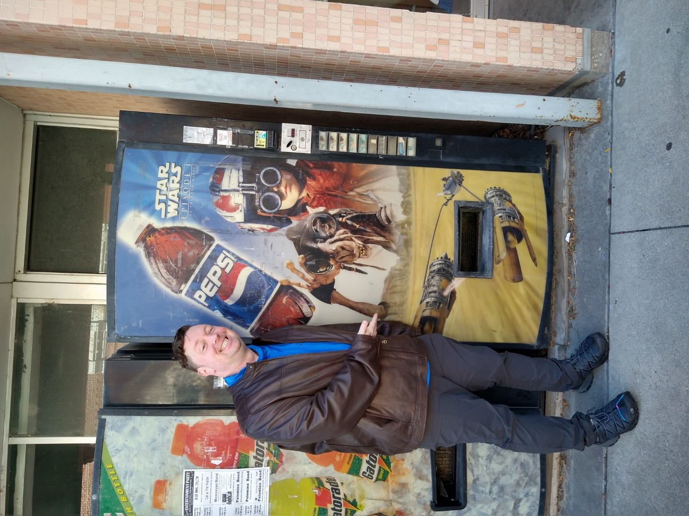

???

- This is me!

---
class: center

And...... This is me!

???

And...... This is me!

---
class: center

And...... This is me!

???

And...... This is me!

---
class: center

And...... This is me!

???

And...... This is me!

---
class: fullbleed
background-color: black

.absolute.w-7-12th.pa-3.l-1-12th.t-20pct.ba.bw-4.br-4.bg-white-60pct[
How do you want to be remembered?
]

???

How do you want to be remembered?

It's the question we're trying to get to the bottom of today.

---
background-image: url(images/bender-futurama.gif)
background-size: cover

???

Look. 
- Regardless of the effort that we put into it, we don't get to pick how we are remembered. 
- We _CAN_ communicate to people how we'd like to be remembered.
- We can also make it easier for people to remember us by organizing our own lives.

---

class: center
# Maslow's hierarchy of needs

???

# The psychology of legacy
## Legacy is a question of privilege.
- If we look at Abraham Maslow's hierarchy of needs, we have to acknowledge something.
- Prestige and accomplishment are higher level needs.
- We can only really think about them if the lower needs are taken care of.
- Coming out of a pandemic, however, We are in a time of transition.
- We've been collectively worried about security and safety for a while. 
- Now might be the time to take a breath and look further up the pyramid. 
---
class: center
# The scope of your digital legacy.
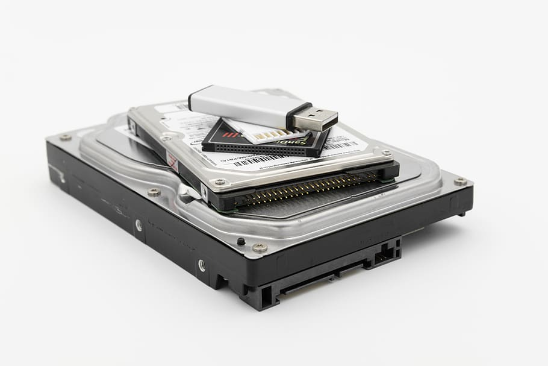

???

# Let's talk about the scope of our digital legacy.  

- It's either coming from or going to end up on something like these hard drives, memory cards, and flash drives.
- Today, I'm trying to get you to think about making your digital life a little easier to view, save, and share.

---
class: img-caption
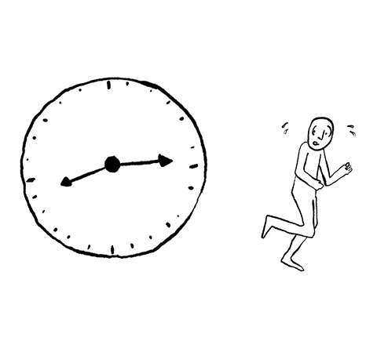

# Why do this now?

???

# Why do this now?
## It might not always be this easy.
## In the future, you may have:
- Aphasia or brain stuff
- Vision issues
- Injuries or conditions that affect your ability to type or use a mouse (just ask Clark)
- Other stuff
- Also, even if your stuff is hosted online for free, it may not stay there forever.
---
background-image: url(images/not-financial-advice-slower.gif)
background-size: cover

???

# Disclaimers!

- I'm not a financial consultant
- I'm not a lawyer
- I'm a software developer
- I'm not trying to sell you life insurance
- You should probably have a will, but I'm not qualified to give that advice.

---
class: img-right
# You can choose your own adventure!

Your digital legacy is shaped by:
- Your passions
- Your hobbies
- Your family and friends
- Your technology
- Your curation and organization
- Your investment (time/money)

???
# Your digital legacy is yours to shape!
## You get to choose your own adventure.

It is shaped by the things you do, and the effort (and investment) that you put into curating and organizing it.

---
class: img-caption

# The bus factor

???

# Let's talk about the bus factor.
## If a bus hits you, and you're not around tomorrow, what are the things that need taking care of?
#### At your job, they replace you.
#### At home, things aren't as simple.
#### As far as I can tell, personal stuff falls into three categories:
- Practical stuff
- Digital assets and presence
- Digital media
---

class: img-right
# Practical stuff

- Bill paying
- Bank stuff
- Business stuff
- Access to shared resources

???

# First Category-
### Practical stuff

- Bill paying
- Bank stuff
- Business stuff
- Access to shared resources

## Anything that helps people continue the day-to-day stuff without you.
- This is the sort of stuff that should be in your will.  
- Write a will. Don't risk the alternative. I hear probate sucks.

---
class: col-2
# Practical Stuff: Good Ideas vs. Bad Ideas

- List out utilities and subscriptions
- Make sure there are no payment surprises
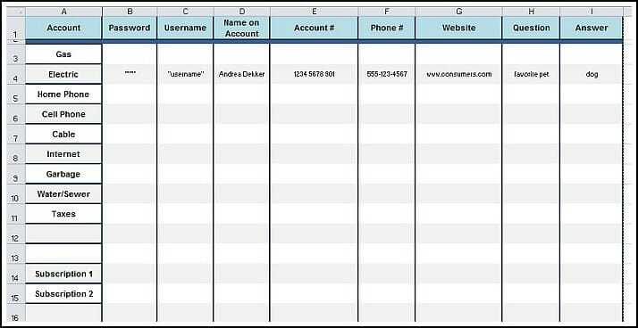

- Write all your passwords in plaintext on paper
- Forget about 2FA
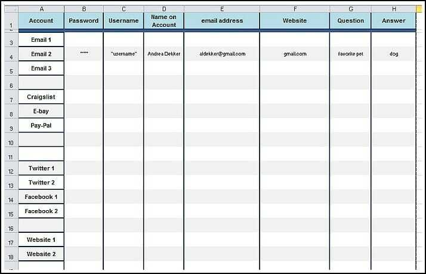

???

- With the help of the Internet, I was able to find a [worksheet](https://andreadekker.com/free-printable-password-worksheet/) to help with the practical stuff.
- There are some good and bad things in there.
- Good: 
 + Make sure there are no surprises with payments and subscriptions!
- Bad: 
 + Write all of your passwords on a piece of paper!
- Make sure you are thinking about digital items when discussing a will.

---
class: img-caption

# Password Managers

???

# You should probably use a password manager
- I'm not going to get too into the weeds on which one, for the sake of time.
- Think about how someone else might be able to access the passwords in your manager, though.

---

class: img-right
# Digital assets with a financial property

- Cryptocurrency
- Domain names
- Digital business assets
- Loyalty points
- Travel rewards

???

# Second Category:
### Digital assets with a financial value
- Cryptocurrency
- Domain names
- Digital business assets
- Loyalty points
- Travel rewards

## Digital assets with a financial value should be in your will.
## Other than that, I'm not really qualified to talk about this.

---
class: img-right
# Digital media and social accounts
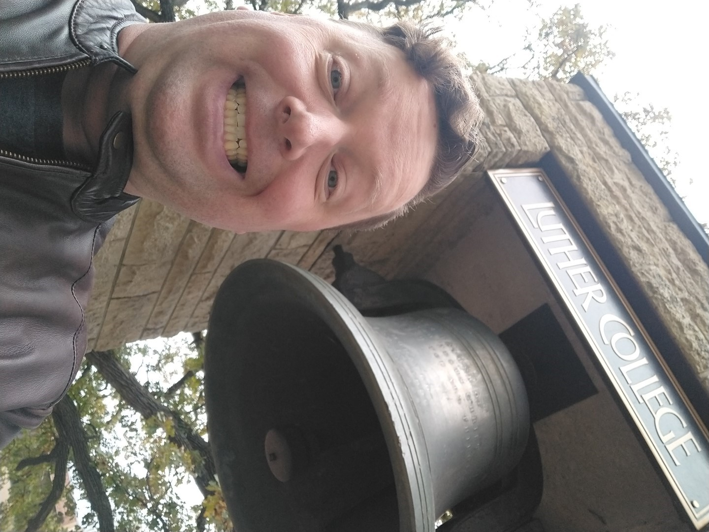

- Social media accounts
- Photos
- Art
- Documents
- Audio
- Open source code
- Videos
- Cloud storage

???

# The third category:
## Digital media and social accounts 
- Generally these are the digital items that have sentimental value, not monetary value.
- From here, it might be good to follow along with the worksheet that I've handed out.
---
class: title, smokescreen, shelf, no-footer
background-image: url(images/trieditout2008.jpg)

# What do you create?
## What do you _want_ to create?
???

# What do you create?
## Do an inventory of: 
- The stuff you've made
- The stuff you're making
- The stuff you'd like to make

I'll give you some examples over the next few slides.
---
class: img-right

# Old Blogs or Forum Posts
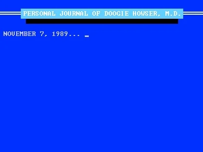

-  Blogger
-  Reddit
-  Medium
-  Live Journal
-  Typepad
-  Wordpress
-  phpBB forum posts
-  USENET posts

???

# Did you post about major life events on an old blog or forum?
## Epic rants about Star Wars or Microsoft?
- Go through your old blogs and forums (if you still can) and see if there's anything worth saving.
- Alternatively, see if there's anything that's emblematic of its time

Examples:
- Early experiences with computers, cell phones, and laptops
- First experiences with Wi-Fi
- Information about daily life around big life or world events

---
class: img-right
# Photos and Art sites

-  Flickr
-  Pinterest
-  Tumblr
-  Instagram
-  Snapchat
-  DeviantArt
-  Photobucket

???

# Photos and Art sites
- Did you know THAT Conference has a flickr feed?  There might be some pictures of you in it.
- Do you have any favorite pictures of food or pets?
- Is your art or cosplay posted somewhere?
- In some cases, you might need to pay to access it, such as Photobucket, which ended free accounts recently.

Make sure to find it.
---
class: img-right
# Audio and Video

-  Vimeo
-  Youtube
-  Soundcloud
-  Twitch
-  Podcast platforms

???

# Audio and Video
- Where have you posted clips?
- Have you started any podcasts?
- Video upload sites don't seem to live as long on the Internet due to storage costs (remember blip.tv?), so make sure that you have your video somewhere else.
- Twitch streams automatically delete themselves unless you save them.

Make sure to look at the retention policies where you have your stuff.
---
class: img-left
# Code, Applications, and Websites

-  GitHub ([Appoint a Successor](https://docs.github.com/en/account-and-profile/setting-up-and-managing-your-personal-account-on-github/managing-access-to-your-personal-repositories/))
-  GitLab
-  Sourceforge
-  Bitbucket
-  [Gickup](https://github.com/cooperspencer/gickup)

???

# Code
## Are you the random person from Nebraska?

- If you have websites or apps, do they depend on payments or external intervention to work? Did you write that down anywhere?
- You know, you should probably improve your documentation....
- Also, does your code (or the work you do) help people? Tell the story about who your software helps and how.
- If you're on GitHub, and you want people to be able to continue using your repos after you're gone, there's already a feature to help out. 
 + It's called [naming a successor](https://docs.github.com/en/account-and-profile/setting-up-and-managing-your-personal-account-on-github/managing-access-to-your-personal-repositories/maintaining-ownership-continuity-of-your-personal-accounts-repositories).  I'll have a link in my session page. 
- Also, someone (named Cooper Spencer) wrote a tool called [Gickup](https://github.com/cooperspencer/gickup) that can be used to back up source code repos between different code sites, you might want to check that out.

--- 
---
class: img-left

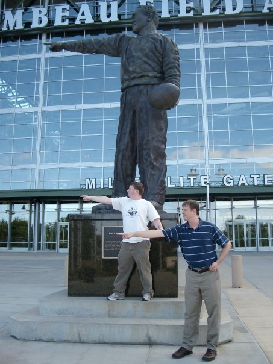

# Social networks
-  Facebook
-  LinkedIn
-  Twitter
-  Instagram
-  Threads
-  ~~Google Plus~~
-  ~~Myspace~~

???

# How much do you post to social networks?
## Is there anything posted here that you don't have someplace else?
- Also, don't forget images that other people have taken of you.
- Apparently this photo was posted by a friend in 2009 when we visited Lambeau Field together.
- Not every social network stays around.  If you want to keep stuff, you can't bank on it existing forever.
- Myspace, might actually be able to be resurrected, though.

---
background-image: url(images/DLA-Crest.jpeg)
background-size: stretch

???

# Do you want your social media posts to outlive you?
Would you like to be forgotten? Some social networks offer the option of deleting an account or allowing a successor access if you have the proper documentation.

A good resource to know is the *Digital Legacy Association*.
- They are from the UK
- They specialize in offering resources and guides for dealing with your digital legacy.
- [DigitalLegacyAssociation.org](https://digitallegacyassociation.org/)
---
class: img-caption
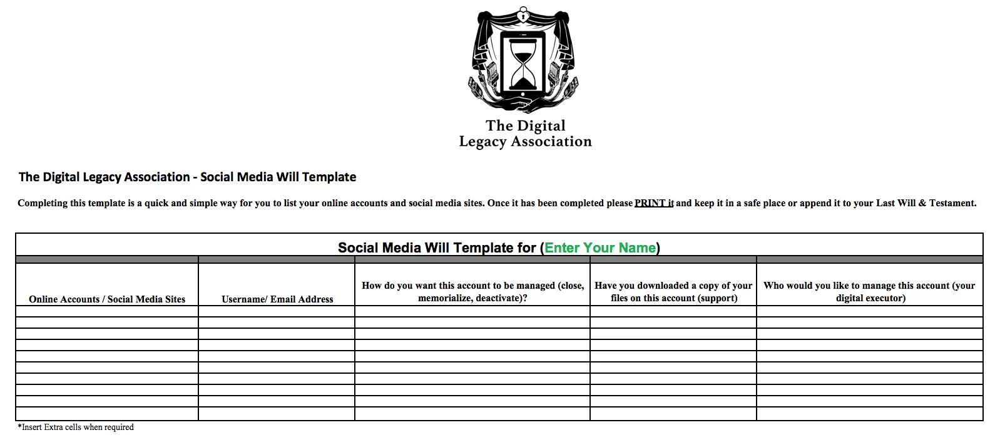
# A Social Media Will template

???

- One nice resource they have is a [social media will template](https://digitallegacyassociation.org/social-media-will-template/)
- It's not legally binding, but it serves as a good tool for tracking what you would like done with your social media.
- It has a column to track whether you've downloaded your content off the platform already.
- The template also includes links to the current policies from social media companies on what needs to be done to act on these accounts.
- Some accounts allow for a successor to be named, others require documentation from the government, like a death certificate.
- Good luck with Twitter.
- Check the DLA resources out!
---
class: img-right
# Analog and Offline storage
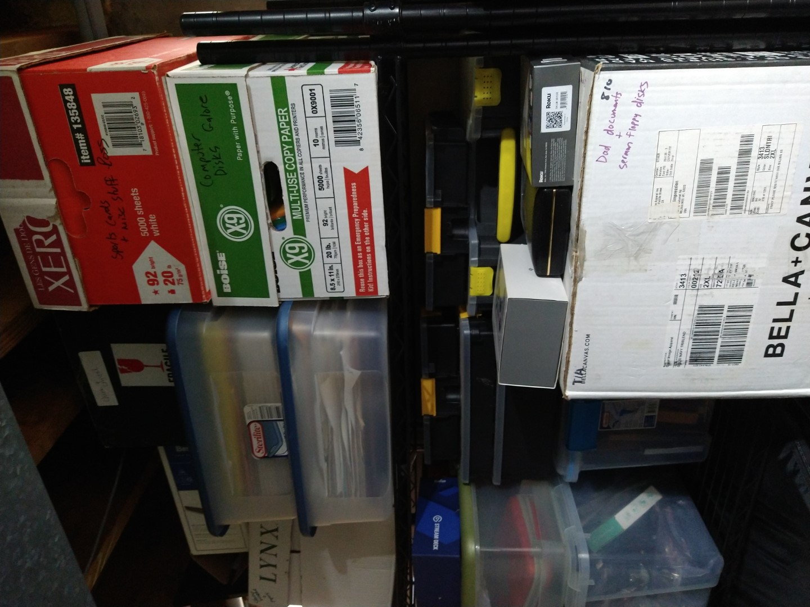

- If it's a document/image, can you scan it?
- If it's a disk/card, can you still read it?
- If it's analog, can you convert it?
- Should you just pay someone else to do it?

???

# OK, We've looked online.
### Now, let's get into the labor-intensive stuff
- Do an inventory of the things that aren't digital but that you would like to be.
- Do you know where stuff is? Is it already organized or is it all over the place?
- Is it in your physical possession or are you going to need to reach out to people?
- Do you know everything that exists? 
 + Is there a chance that a parent or someone else has something in their basement or closet?
- How hard is your stuff to digitize, are we talking DVDs and SSDs or Advantix film, old floppy disks and reel to reel audio? 
---
class: col-2
# Scanning: "Cheap" versus "Expensive"

- Used scanners
- Smartphone scanning apps
- Borrowed equipment
- Some scanning services (for small quantities)

- Large format scanners
- Automated Document Feed scanners
- High Speed/High DPI scanning
- Film and negative scans

 

???

## Photo Scanning: What's it going to cost?
Cheap
- One cheap option is used scanners and multifunction printers from craigslist or eBay.
- There are some smartphone apps for using your phone's camera to scan photos, but results may vary.
- You might also be able to use the fancy printer/scanner at your office for free or cheap.
- With flatbed scanners, look for scanning software that allows scanning multiple photos at once.
- With low quantities, a service (like [Costco's photo transfer service](https://www.costcodvd.com/services-and-pricing/photograph-transfer)) might be the best option

Expensive
- If you have large formats or lots of photos, an extra large flatbed scanner might be your best option
- An automated feed scanner might be best if you have large numbers of photos
- Companies like [SlideSnap](https://slidesnap.com/) make bespoke scanners for slides and film if you have piles of those.
- Odd or obscure formats like APS/Advantix film might require rare, expensive equipment.
- A slow, old scanner might save you a few dollars but cost you tens or hundreds of hours of time.
- Wireless functionality might cost you more.
- Your formats and quantities should help you determine:
- _Should I just pay someone else to do it?_

---
class: img-left
# Other media: Can you "USB it"?
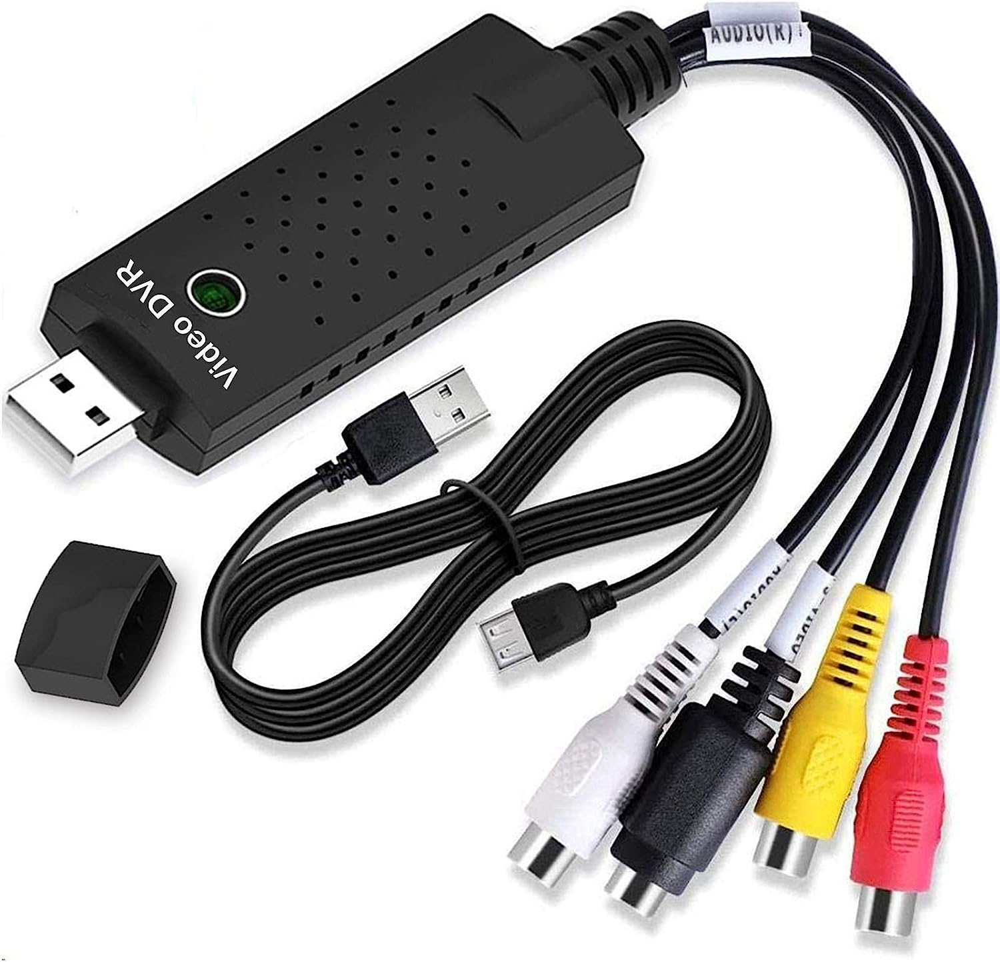

- USB to RCA adapters
- USB 3.5" floppy
- USB CD/DVD/Bluray drives
- USB SATA/IDE hard drive docks
- USB Greaseweazle V4 (5.25" Floppy)

???
# Can I "USB it"?

- In the olden days, expensive capture cards were the norm.
- That isn't always the case any more.
- Is there a way to "USB it" now?
- If your devices can output to RCA, then you can input it to USB pretty cheaply
- Open Source software like OBS scan help you get digital.
- Thrift stores, craigslist, and Amazon can be your friend

---
class: img-right
# Tips and Tricks
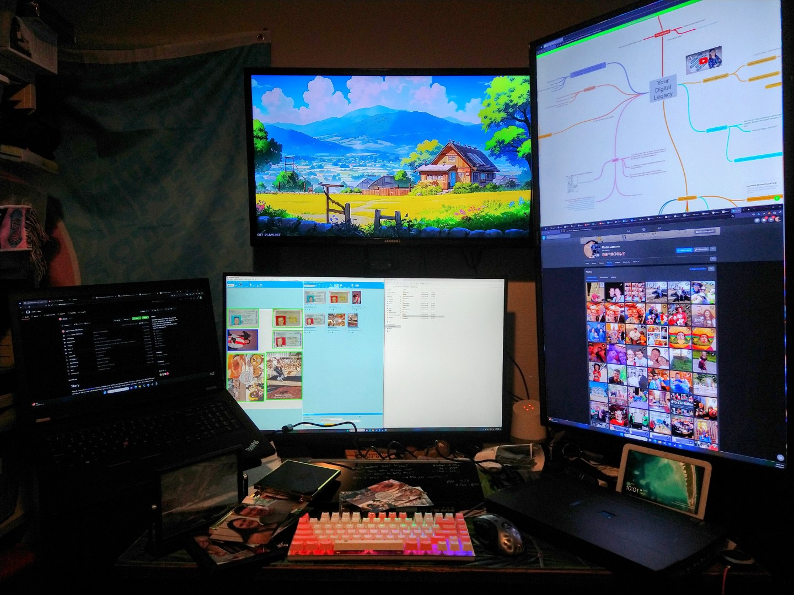

- Organize first, digitize next
- Do your research
- Don't reinvent the wheel
- Take your time
- Make it fun
- Ask questions!

???
# Tips and tricks

I will try to allow some time at the end, and I'm planning an Open Space, but here are some preliminary tips and tricks:
- Don't rush into digitizing.  The effort that you put into organizing can pay dividends, because moving around unsorted files can be annoying.
- Don't reinvent the wheel if you don't have to.  Research what other folks have done to digitize similar content. Check out Reddit posts if Reddit still exists when you're doing your work.
- It's not a race, so take it slow and steady. Try to take the time to add metadata (like notes or dates written on photos) while you're working, because you may not be looking at the physical media again in the foreseeable future.
- Find ways to make it fun.  Listen to podcasts, watch TV, or do something to allow yourself to enjoy the process.
- If some of the stuff you have brings up questions, write them down! Reach out to folks to answer any questions you have or get more context that you may be missing.

---
class: img-left
# Storage and centralization

- The data has to go somewhere
- Some files are bigger than others
- Make a plan
- Descriptive folders are useful
- Distinguish between raw and converted files

???

# So, you're going to digitize your world.
### Where's it going to go?

- Once you start, the data has to go somewhere.
- It might get out of hand if you don't plan for how much data you're creating.
- Depending on what you're digitizing, your space needs will vary.
 + A pile of scanned photos will take much less room than hours of high quality video.
- One way to organize is with folder and filenames. Good descriptions can get you a long way.
- If your files require post-processing, like removing tape noise or doing color correction, make sure to create clear distinctions between your originals, raw working files, and output. 
 + You may not care about anything but the output, but you might want to clearly organize and name the files, so your decision is easier to make.

---
class: img-left
# Adding context

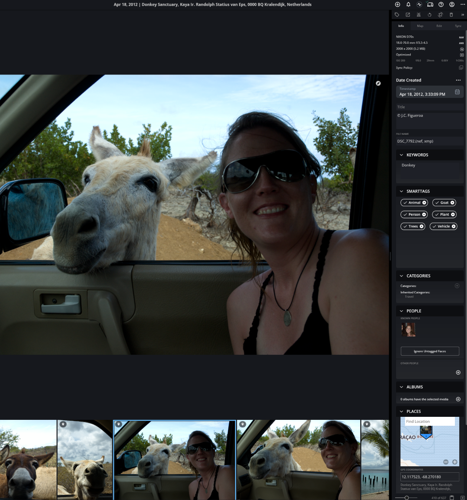

Context:
- Dates
- Places
- Events
- People
- Things
- Stories

???

# Adding context and metadata

Wherever you can add more information, try to do so.
- This is particularly useful for scanned images, because they won't have the EXIF data from the camera like digital images.
- In whatever app you use, there's probably an image information tab or something similar.
- If you're uploading to Youtube, there's a lot of additional data that you can provide about the upload.

---
background-image: url(images/3-2-1-Backup-Rule.png)
background-size: stretch

???

# Backups
What is the 3-2-1 Backup rule?
1. Have at least 3 copies of your data
2. Keep the copies on 2 different media
3. Store 1 copy off-site

- One of the copies can the one on your current computer.
- Two media means don't keep your copies on the same drive.
- One off-site copy means either in the cloud or a drive outside your house, like in a safe deposit box. Most people pick the cloud.
---
class: img-caption

# The Walled Garden

???
# Are you in a big company's walled garden?
- (Apple, Google, Microsoft, Amazon, Facebook, etc.)
- Sometimes you get some cool features and integrations, but have you considered all the costs?
- Are you happy with this?
- I use some of these, but I just want you to reflect on your decision, since it's an easy choice to default into and then stay in because it's annoying and scary to change.
---
class: img-right
# De-Clouding and Independent Mananagement

-  Mylio
-  Photoprism
-  Tonfotos
-  Ente

???
#### Want to get stuff out of the cloud and manage it locally?
Some of the software is starting to have features that rival the big walled gardens.
Here's some software that I found:
- Mylio
 + Seems like good software - paid level downloads media from your online accounts and centralizes everything into one place
 + Searches for duplicate photos in your collection
 + Appears to have the best documentation online
 + Also includes editing functionality
- Photoprism
 + AI Powered, runs at home, on private server, or in the cloud
 + Can tag photos of faces
- Tonfotos
 + Features a family tree option when classifying photos
- Ente
 + Focuses on security and privacy

Many of these apps are being actively developed and may have more features in the future.  Make sure to look at the difference between free and paid versions, pricing, complexity, and any other features that are important to you. Some of these run off SaaS models, so the monthly fees could add up.

---
class: img-left
# It's not all about you, is it?

Think about:
- Family
- Friends
- Tech Conferences
- Groups

???
# But, it's not all about you, is it?
- Presumably you're not getting into this to just look at your own reflection like Narcissus
- Think about groups that you're a part of, and the people you love and care about.
- Where do you fit into the big picture?
- This is sometimes where people get big into genealogy projects.
- Remember, it's not your job to be the official historian of everything!
---
class: img-right
# Make a 30 Day Plan
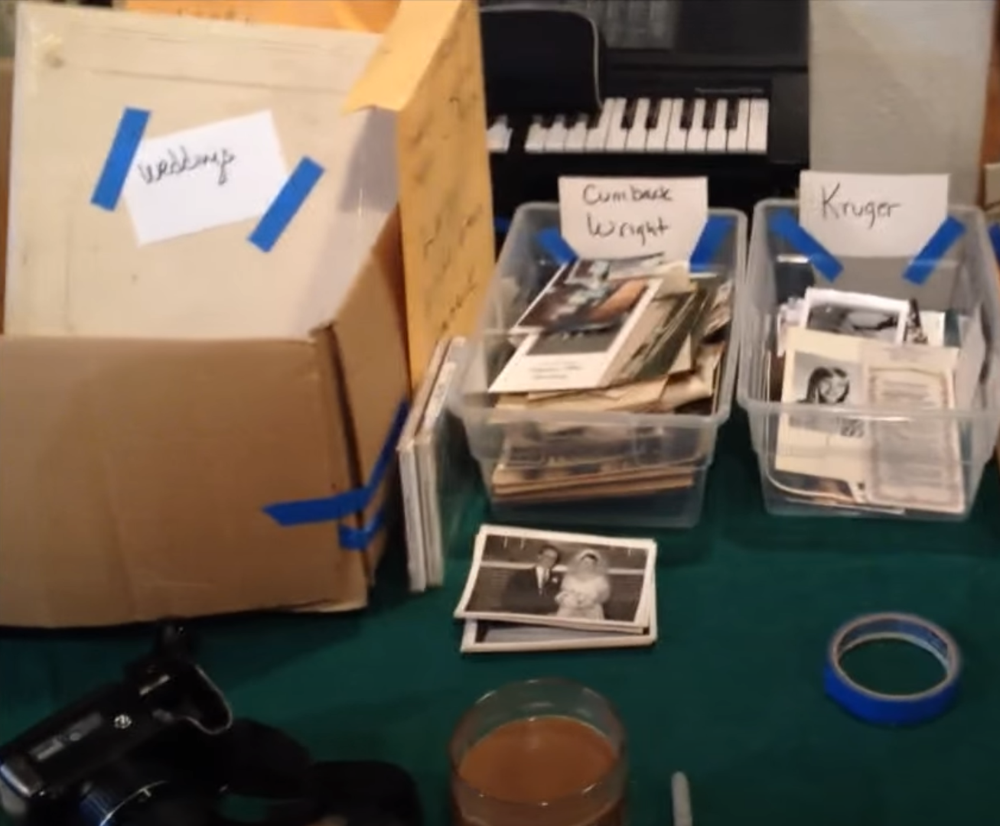

- Collect/Connect
 + Download and centralize
 + Convert and enhance
- Select/Reflect
 + Curate high quality photos
 + Add additional context
- Protect
 + Make a plan for storage
 + 3-2-1!

???

# Make a 30 day plan

Congratulations, you have a huge box full of unorganized photos and media. It's depressing and overwhelming.

Let's come up with a plan to do something about it over the next 30 days.

- Collect the physical
- Connect the digital
- If you've got everything together, take some time to organize
- Determine your digitization strategy
- Curate your collection to find the best stuff
- See what questions you have and get some answers
- Protect your work

You don't have to finish all of these steps in a month.  The goal is to make a plan, and to make some progress.
---
class: img-caption
# Collecting Stories and Asking Questions

???

# Collecting stories

- Don't underestimate the value of stories in this process. It can turn a picture into a memory, or give context to something that seems boring or irrelevant.
- Don't know what questions to ask? No problem!
- There's a company called StoryCorps that specializes in creating good conversations.
 + They have a ton of questions to use!
- Their website is [storycorps.org](https://storycorps.org/participate/great-questions/)
 + I'm including a link in the session links.
---
class: img-caption
# Sharing Technology Memories
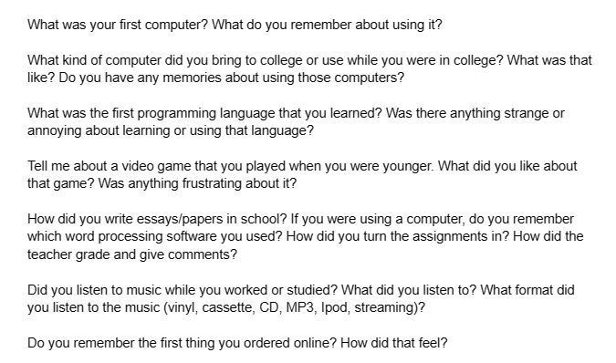

???

- One thing that StoryCorps didn't have is great technology questions, so I made some!
- Handouts are available, and a PDF is available, too.
- Feel free to answer them yourself, or ask other people at meals during the conference!
---
class: img-caption
# Conversations To Have
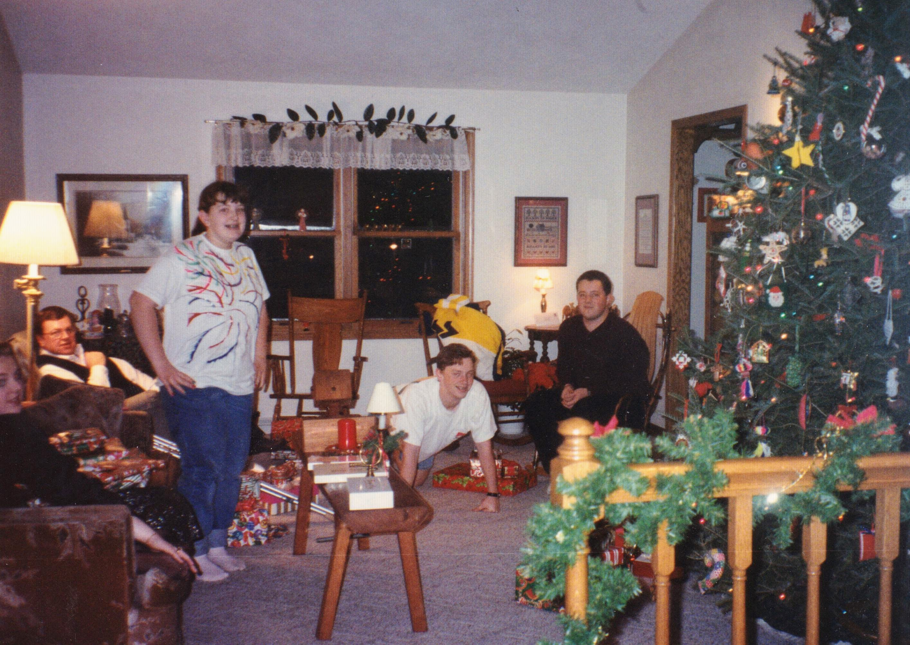

???

# Conversations to have
- Now that you have a plan, who can help you execute it?
- Who are the people that can give you information you don't have?
- What sort of questions would you like to ask?
- Who is still around to ask?
- Some pictures are worth even more than a thousand words. This is one of mine.
- Your digital legacy is partially in your control. How do you want to shape it?

---

class: img-caption

# Questions? Thoughts?

???

# Any Questions?

---
class: title, smokescreen, shelf, no-footer
background-image: url(images/Pitch_Pine_Sapling.jpg)

# Thank you!

???

# Thank you!
---
background-image: url(that/Session_Survey_Speaker_rsl_qr.png)
background-size: cover

???

# Please do a survey!
[https://that.land/3O907sc](https://that.land/3O907sc)
---
class: compact
 ### Credits
- Pine sapling picture courtesy of Kieran Hunt, [CC BY-SA 4.0](https://creativecommons.org/licenses/by-sa/4.0) , via Wikimedia Commons
- gif of Bender's tomb courtesy of Futurama's [A Pharoah to Remember](https://en.wikipedia.org/wiki/A_Pharaoh_to_Remember) via [tenor](https://tenor.com/view/bender-futurama-remember-me-gif-23132019)
- Maslow's simplified hierarchy of needs courtesy of [Wikipedia](https://en.wikipedia.org/wiki/Maslow%27s_hierarchy_of_needs).
- Beat the running clock gif courtesy of [Andre Gola](https://www.andregola.com/) via [giphy](https://giphy.com/gifs/2zoCrihrueMUVOZlTx)
- Not financial advice gif courtesy of [Sara Dietschy](https://www.saradietschy.com/) via [giphy](https://giphy.com/clips/SaraDietschy-finances-financial-advice-not-HHMupmVbcXi4WCdxie)
- Picture of hard drives, flash card and USB stick courtesy of [pxfuel](https://www.pxfuel.com/en/free-photo-oghzv)
- Choose your own Adventure book cover is [Supercomputer](https://www.goodreads.com/en/book/show/755062) by [Edward Packard](https://www.edwardpackard.com/).
- Picture of bus courtesy of the [City of Madison Metro Transit](https://www.cityofmadison.com/metro/routes-schedules/bus-rapid-transit/need-for-brt)
- Pile of letters and bills on a table, generated by [imagine.art](https://www.imagine.art/dashboard/tool/from-text/6fa7102a-25c4-4054-81f5-29fc4fc20f76) - seed: 860341
- Free printable password worksheet comes from [Andrea Dekker](https://andreadekker.com/free-printable-password-worksheet/)
- Crypto coins in hand courtesy of [Wikimedia](https://commons.wikimedia.org/wiki/File:Crypto_Wallet_-_Cryptocurrency_Medallions_Alongside_Wallet.jpg)

---
class: compact
 ### More Credits
- Doogie Howser Journal courtesy of [Doogie Howser MD](https://en.wikipedia.org/wiki/Doogie_Howser,_M.D.) via [giphy](https://giphy.com/gifs/old-computer-doogie-howser-3otO6xQxvlzQAAyhLG)
- Picture of bed from [tumblr](https://www.tumblr.com/glowtinggg/715903887201239040)
- Digital Legacy Association logo from [digitallegacyassociation.org](https://digitallegacyassociation.org/)
- Disks galore image via [The Life of Kenneth Blog](https://blog.thelifeofkenneth.com/)
- Picture of donkey and woman with image info via [JC Figeroa](https://www.linkedin.com/in/jc-figueroa) and the [Mylio demo app with sample pictures](https://mylio.com/)
- 3-2-1 Backup image courtesy of [Cactus IT](https://cactus-it.co.uk/the-3-2-1-backup-rule/)
- Picture of Edzell Castle walled garden via Jonathan Oldenbuck, [CC BY-SA 3.0](https://creativecommons.org/licenses/by-sa/3.0/)
- Picture of Cloud and building generated by [imagine.art](https://www.imagine.art/dashboard/tool/from-text), prompt: "a picture of a digital cloud cyberpunk" seed: 497500 
- Image of Narcissus by Caravaggio - Self-scanned, [Public Domain](https://commons.wikimedia.org/w/index.php?curid=25450745) 
- Image of photos in containers via [Simplify Scanning](https://www.youtube.com/@simplify_scanning4124) video [Sorting That Photo Pile](https://youtu.be/TVHFFU-SjUc)
- Image of question bubbles comes from [storycorps.org](https://storycorps.org/participate/great-questions/)
- "Looking let me think" gif courtesy of TipsyElves.com via [giphy](https://giphy.com/gifs/tipsyelves-math-26gR0YFZxWbnUPtMA)
