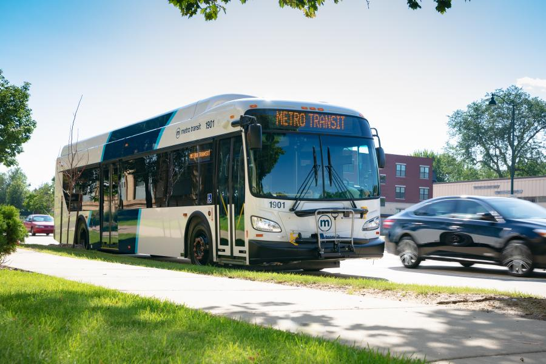

class: title, smokescreen, shelf, no-footer
background-image: url(images/Pitch_Pine_Sapling.jpg)

# Your Digital Legacy
## Getting your (digital) life in order

???

Make sure you're in the right room!
---
background-image: url(that/That-Conference-Branding-Slide.png)
background-size: cover

???

# Welcome to THAT Conference 2023!

- Background images don't appear to scale correctly unless I also apply "background-size: cover" to the slide.-

---
background-image: url(that/That-Conference-Partners-Slide.png)
background-size: cover

???
# Sponsors 

Sponsors are great.  Without them, That Conference would not be possible.  I'm thankful for them.

---
background-image: url(that/THAT.us.png)
background-size: cover

???

That.us is pretty great.  Come and join the conversation, all year long!

---
background-image: url(that/THAT-Dates.png)
background-size: cover

???

Also.... It's never to early to start thinking about next year!
---
# Slides and Session Information

.qrcode.db.fr.w-40pct.ml-4[]

- General session info available at https://rosslarson.com/talks/
- Slides are at https://rosslarson.com/slides/ or just use the QR code
- Ask questions anytime

???

Here's a QR Code if you want to follow along on your laptop or phone.
Ask questions anytime.
---
class: img-left
# About Me

- Software Developer at Paradigm
- Luther College Alumnus
- Board Member, [Forward Fest](https://forwardfest.org/)
- Father
- Gamer
- Sports fan
- Survivor

@rosslarsonWI

hello@rosslarson.com

THAT Slack : rosslarson

???

Hi. I'm Ross.

I'm a father, a gamer, a coder, a sports fan, a geek, and other stuff.

The coding usually I do in my free time is:
-  Hugo Static sites and 
- .NET Core apps, often web scrapers.

---
class: col-2

# This is me!

???

- This is me!

---
class: center

And...... This is me!

???

And...... This is me!

---
class: center

And...... This is me!

???

And...... This is me!

---
class: center

And...... This is me!

???

And...... This is me!

---
class: fullbleed
background-color: black

.absolute.w-7-12th.pa-3.l-1-12th.t-20pct.ba.bw-4.br-4.bg-white-60pct[
How do you want to be remembered?
]

???

How do you want to be remembered?

It's the question we're trying to get to the bottom of today.

---
background-image: url(images/bender-futurama.gif)
background-size: cover

???

Look. 
- Regardless of the effort that we put into it, we don't get to pick how we are remembered. 
- We can remind people how we'd like to be remembered.
- We can also make it easier for people to remember us by organizing our own lives.

---

class: center
# Maslow's hierarchy of needs

???

# The psychology of legacy
## Legacy is a question of privilege.
- If we look at Abraham Maslow's hierarchy of needs, we have to acknowledge something.
- Prestige and accomplishment are higher level needs.
- We can only really think about them if the lower needs are taken care of.
- Coming out of a pandemic, however, We are in a time of transition.
- We've been collectively worried about security and safety for a while. 
- Now might be the time to take a breath and look further up the pyramid. 
---
class: center
# The scope of your digital legacy.

???

# Let's talk about the scope of our digital legacy.  

- It's either coming from or going to end up on something like these hard drives, memory cards, and flash drives.
- Today, I'm trying to get you to think about making your digital life a little easier to view, save, and share.

---
class: img-caption

# Why do this now?

???

# Why do this now?
## It might not always be this easy.
## In the future, you may have:
- Aphasia or brain stuff
- Vision issues
- Injuries or conditions that affect your ability to type or use a mouse (just ask Clark)
- Other stuff
---
background-image: url(images/not-financial-advice-slower.gif)
background-size: cover

???

# Disclaimers!

- I'm not a financial consultant
- I'm not a lawyer
- I'm a software developer
- I'm not trying to sell you life insurance
- You should probably have a will, but I'm not qualified to give that advice.

---
class: img-right
# You can choose your own adventure!

Your digital legacy is shaped by:
- Your passions
- Your hobbies
- Your family and friends
- Your technology
- Your curation and organization
- Your investment (time/money)

???
# Your digital legacy is yours to shape!
## You get to choose your own adventure.

It is shaped by the things you do, and the effort that you put into curating and organizing it.

---

class: img-caption

# The bus factor

???

# Let's talk about the bus factor.
## If a bus hits you, and you're not around tomorrow, what are the things that need taking care of?
#### At your job, they replace you.
#### At home, things aren't as simple.
#### As far as I can tell, personal stuff falls into three categories:
- Practical stuff
- Digital assets and presence
- Digital media
---

class: img-right
# Practical stuff

- Bill paying
- Bank stuff
- Business stuff
- Access to shared resources

???

The first set of items is "Practical stuff".

- Bill paying
- Bank stuff
- Business stuff
- Access to shared resources

## Anything that helps people continue the day-to-day stuff without you.
- This is the sort of stuff that should be in your will.  
- Write a will. Don't risk the alternative. I hear probate sucks.

---

class: img-right
# Digital assets with a financial property

- Cryptocurrency
- Loyalty points
- Travel rewards
- Domain names
- Digital business assets

???

# Digital assets with a financial value
- Cryptocurrency
- Loyalty points
- Travel rewards
- Domain names
- Digital business assets

# Digital assets with a financial value should be in your will.
## Other than that, I'm not really qualified to talk about this.

---
class: col-2
# Good Ideas vs. Bad Ideas

- List out utilities and subscriptions
- Make sure there are no payment surprises

- Write all your passwords in plaintext on paper
- Forget about 2FA

???

- With the help of the Internet, I was able to find a worksheet to help with the practical stuff.
- There are some good and bad things in there.
- Good: Make sure there are no surprises with payments and subscriptions!
- Bad: Write all of your passwords on a piece of paper!
- Make sure you are thinking about digital items when discussing a will.

---
class: img-caption

# Password Managers

???

# You should probably use a password manager
- I'm not going to get too into the weeds on which one, for time.
- Think about how someone else might be able to access the passwords in your manager, though.

---
class: img-right
# Digital media and social accounts

- Social media accounts
- Photos
- Art
- Documents
- Audio
- Open source code
- Videos
- Cloud storage

???

# The third category of digital assets
## This is where I'm going to focus in this session.
- From here, it might be good to follow along with the worksheet that I've handed out.
---
class: title, smokescreen, shelf, no-footer
background-image: url(images/trieditout2008.jpg)

# What do you create?
## What do you _want_ to create?
???

# What do you create?
## Do an inventory of: 
- The stuff you've made
- The stuff you're making
- The stuff you'd like to make

I'll give you some examples over the next few slides.
---
class: img-right

# Old Blogs or Forum Posts

-  Blogger
-  Medium
-  Live Journal
-  Typepad
-  Wordpress
-  phpBB forum posts
-  USENET posts

???

# Did you post about major life events on an old blog or forum?
## Epic rants about Star Wars or Microsoft?
- Go through your old blogs (if you still can) and see if there's anything worth saving.
- Alternatively, see if there's anything that's emblematic of its time

Examples:
- Early experiences with computers, cell phones, and laptops
- First experiences with Wi-Fi
- Information about daily life around big life or world events

---
class: img-right
# Photos and Art sites

-  Flickr
-  Pinterest
-  Tumblr
-  Instagram
-  Snapchat
-  DeviantArt
-  Photobucket

???

# Photos and Art sites
- Did you know THAT Conference has a flickr feed?  There might be some pictures of you in it.
- Do you have any favorite pictures of food or pets?
- Is your art or cosplay posted somewhere?
- In some cases, you might need to pay to access it, such as Photobucket, which ended free accounts recently.

Make sure to find it.
---
class: img-right
# Audio and Video

-  Vimeo
-  Youtube
-  Soundcloud
-  Twitch
-  Podcast platforms

???

# Audio and Video
- Where have you posted clips?
- Have you started any podcasts?
- Video sites don't seem to live as long due to storage costs (remember blip.tv?), so make sure that you have your video somewhere else.

Make sure to find it.
---
class: img-left
# Code, Applications, and Websites

-  GitHub
-  GitLab
-  Sourceforge
-  Bitbucket
--

- [Appoint a successor in GitHub](https://docs.github.com/en/account-and-profile/setting-up-and-managing-your-personal-account-on-github/managing-access-to-your-personal-repositories/maintaining-ownership-continuity-of-your-personal-accounts-repositories)
- [Gickup](https://github.com/cooperspencer/gickup)

???

# Code
## Are you the random person from Nebraska?

- If you have websites or apps, do they depend on payments or external intervention to work? Did you write that down anywhere?
- You know, you should probably improve your documentation....
- Also, does your code help people? Tell the story about who your software or work helps and how.
- If you're on GitHub, there's already a feature to help out. It's called [naming a successor](https://docs.github.com/en/account-and-profile/setting-up-and-managing-your-personal-account-on-github/managing-access-to-your-personal-repositories/maintaining-ownership-continuity-of-your-personal-accounts-repositories).  I'll have a link in my session page. 
- Also, someone wrote a tool called [Gickup](https://github.com/cooperspencer/gickup) that can be used to back up source code repos between different services, you might want to check that out.

--- 
---
class: img-left

# Social networks
-  Facebook
-  LinkedIn
-  Twitter
-  Instagram
-  Threads
-  ~~Google Plus~~
-  ~~Myspace~~

???

# How much do you post to social networks?
## Is there anything posted here that you don't have someplace else?
- Also, don't forget images that other people have taken of you.
- Apparently this one was posted by a friend in 2009.
- Not every social network stays around.  If you want to keep stuff, you can't bank on it existing forever.
- Myspace, might actually be able to be resurrected, though.

---
background-image: url(images/DLA-Crest.jpeg)
background-size: stretch

???

# Do you want your social media posts to outlive you?
Would you like to be forgotten? Some social networks offer the option of deleting an account if you have the proper documentation.

A good resource to know is the *Digital Legacy Association*.
- They are from the UK
- They specialize in offering resources and guides for dealing with your digital legacy.
- [DigitalLegacyAssociation.org](https://digitallegacyassociation.org/)
---
class: img-caption

# A Social Media Will template

???

- One nice resource they have is a [social media will template](https://digitallegacyassociation.org/social-media-will-template/)
- It's not legally binding, but it serves as a good tool for tracking what you would like done with your social media.
- It has a column to track whether you've downloaded your content off the platform already.
- The template also includes links to the current policies from social media companies on what needs to be done to act on these accounts.
- Some accounts allow for a successor to be named, others require documentation from the government, like a death certificate.
- Check their resources out!
---
class: img-right
# Analog and Offline storage

- If it's a document/image, can you scan it?
- If it's a disk/card, can you still read it?
- If it's analog, can you convert it?
- Should you just pay someone else to do it?
---
class: col-2
# Scanning: Cheap versus Expensive

- Some scanning services
- Used scanners
- Use your smartphone
- Borrowed equipment

- Large format scanners
- Automated Document Feed scanners
- Film and high DPI scanning

 

???

# Scanning: What's it going to cost?
### Cheap
- With low quantities, a service might (like [Costco's photo transfer service](https://www.costcodvd.com/services-and-pricing/photograph-transfer)) be the best option
- Another cheap option is used scanners and multifunction printers from craigslist or eBay.
- You might also be able to use the fancy printer/scanner at your office for free or cheap.
- With flatbed scanners, look for scanning software that allows scanning multiple photos at once.

### Expensive
- If you have large formats or lots of photos, an extra large flatbed scanner might be your best option
- An automated feed scanner might be best if you have large numbers of photos
- Companies like [SlideSnap(https://slidesnap.com/) make bespoke scanners for slides and film if you have piles of those.

- Your formats and quantities should help you determine:
- _Should you just pay someone else to do it?_

---
class: img-left
# Other media: Can you "USB it"?

- USB to RCA adapters
- USB 3.5 floppy
- USB CD/DVD/Bluray drives
- USB Greaseweazle V4
- USB turntables

???

- Is there a way to "USB it" now?
- If your devices can output to RCA, then you can input it to USB pretty cheaply
- Thrift stores, craigslist, and Amazon can be your friend

---
# Storage and centralization

---
class: img-caption

# The Walled Garden

???
# Are you in a big company's walled garden?
- (Apple, Google, Microsoft, Amazon, Facebook, etc.)
- Sometimes you get some cool features, but have you considered all the costs?
- Are you happy with this?
- I don't have a dog in this race, I just want you to reflect on your decision, since it's an easy choice to default into and then stay in because it's annoying and scary to change.

---
# It's not all about you, is it?
---

class: img-caption

# Questions? Thoughts?

???

# Any Questions?

---
class: title, smokescreen, shelf, no-footer
background-image: url(images/Pitch_Pine_Sapling.jpg)

# Thank you!

???

# Thank you!
---
 ### Credits
- Pine sapling picture courtesy of Kieran Hunt, [CC BY-SA 4.0](https://creativecommons.org/licenses/by-sa/4.0) , via Wikimedia Commons
- THAT Conference Cartoons courtesy of THAT Conference, © 2021 THAT® All rights reserved.
- gif of Bender's tomb courtesy of Futurama's [A Pharoah to Remember](https://en.wikipedia.org/wiki/A_Pharaoh_to_Remember) via [tenor](https://tenor.com/view/bender-futurama-remember-me-gif-23132019)
- Maslow's simplified hierarchy of needs courtesy of [Wikipedia](https://en.wikipedia.org/wiki/Maslow%27s_hierarchy_of_needs).
- Beat the running clock gif courtesy of [Andre Gola](https://www.andregola.com/) via [giphy](https://giphy.com/gifs/2zoCrihrueMUVOZlTx)
- Not financial advice gif courtesy of [Sara Dietschy](https://www.saradietschy.com/) via [giphy](https://giphy.com/clips/SaraDietschy-finances-financial-advice-not-HHMupmVbcXi4WCdxie)
- Picture of hard drives, flash card and USB stick courtesy of [pxfuel](https://www.pxfuel.com/en/free-photo-oghzv)
- Choose your own Adventure book cover is [Supercomputer](https://www.goodreads.com/en/book/show/755062) by [Edward Packard](https://www.edwardpackard.com/).

---
 ### More Credits
- Picture of bus courtesy of the [City of Madison Metro Transit](https://www.cityofmadison.com/metro/routes-schedules/bus-rapid-transit/need-for-brt)
- Pile of letters and bills on a table, generated by [imagine.art](https://www.imagine.art/dashboard/tool/from-text/6fa7102a-25c4-4054-81f5-29fc4fc20f76) - seed: 860341
- Crypto coins in hand courtesy of [Wikimedia](https://commons.wikimedia.org/wiki/File:Crypto_Wallet_-_Cryptocurrency_Medallions_Alongside_Wallet.jpg)
- Free printable password worksheet comes from [Andrea Dekker](https://andreadekker.com/free-printable-password-worksheet/)
- Doogie Howser Journal courtesy of [Doogie Howser MD](https://en.wikipedia.org/wiki/Doogie_Howser,_M.D.) via [giphy](https://giphy.com/gifs/old-computer-doogie-howser-3otO6xQxvlzQAAyhLG)
- Picture of bed from [tumblr](https://www.tumblr.com/glowtinggg/715903887201239040)
- Digital Legacy Association logo from [digitallegacyassociation.org](https://digitallegacyassociation.org/)
- Picture of Edzell Castle walled garden via Jonathan Oldenbuck, [CC BY-SA 3.0](https://creativecommons.org/licenses/by-sa/3.0/)
- "Looking let me think" gif courtesy of TipsyElves.com via [giphy](https://giphy.com/gifs/tipsyelves-math-26gR0YFZxWbnUPtMA)