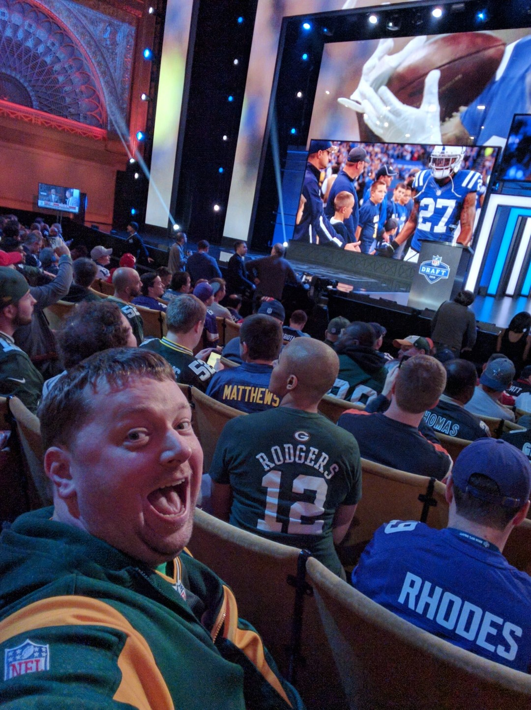

class: title, smokescreen, shelf, no-footer
background-image: url(images/Pitch_Pine_Sapling.jpg)

# Your Digital Legacy
## Getting your (digital) life in order

???

Make sure you're in the right room!
---
background-image: url(that/That-Conference-Branding-Slide.png)
background-size: cover

???

# Welcome to THAT Conference 2023!

- Background images don't appear to scale correctly unless I also apply "background-size: cover" to the slide.-

---
background-image: url(that/That-Conference-Partners-Slide.png)
background-size: cover

???
# Sponsors 

Sponsors are great.  Without them, That Conference would not be possible.  I'm thankful for them.

---
background-image: url(that/THAT.us.png)
background-size: cover

???

That.us is pretty great.  Come and join the conversation, all year long!

---
background-image: url(that/THAT-Dates.png)
background-size: cover

???

Also.... It's never to early to start thinking about next year!
---
# Slides and Session Information

.qrcode.db.fr.w-40pct.ml-4[]

- General session info available at https://rosslarson.com/talks/
- Slides are at https://rosslarson.com/slides/ or just use the QR code
- Ask questions anytime

???

Here's a QR Code if you want to follow along on your laptop or phone.
Ask questions anytime.
---
class: img-left
# About Me

- Software Developer at Paradigm
- Luther College Alumnus
- Admin, [Madison, WI Slack](http://madisoncommunity.org/)
- Father
- Gamer
- Sports fan
- Survivor

@rosslarsonWI

hello@rosslarson.com

THAT Slack : rosslarson

???

Hi. I'm Ross.

I'm a father, a gamer, a coder, a sports fan, a geek, and other stuff.

The coding usually I do in my free time is:
-  Hugo Static sites and 
- .NET Core apps, often webscrapers.

---
class: col-2

# This is me!

???

- This is me!

---
class: center

And...... This is me!

???

And...... This is me!

---
class: center

And...... This is me!

???

And...... This is me!

---
class: center

And...... This is me!

???

And...... This is me!

---
class: fullbleed
background-color: black

.absolute.w-7-12th.pa-3.l-1-12th.t-20pct.ba.bw-4.br-4.bg-white-60pct[
How do you want to be remembered?
]

???

How do you want to be remembered?

It's the question we're trying to get to the bottom of today.

---
background-image: url(images/bender-futurama.gif)
background-size: cover

???

Look. 
- Regardless of the effort that we put into it, we don't get to pick how we are remembered. 
- We can remind people how we'd like to be remembered.

---

class: center
# Maslow's hierarchy of needs

???

# The psychology of legacy
## Legacy is a question of privilege.
- If we look at Abraham Maslow's hierarcy of needs, we have to acknowledge something.
- Prestige and accomplishment are higher level needs.
- We can only really think about them if the lower needs are taken care of.
- Coming out of a pandemic, however, We are in a time of transition.
- We've been collectively worried about security and safety for a while. Let's look further up the pyramid for a change. 
---
class: center
# The scope of your digital legacy.

???

# Let's talk about the scope of our digital legacy.  

- It's either coming from or going to end up on something like these hard drives, memory cards, and flash drives.
- Today, I'm trying to get you to think about making your digital life a little easier to view, save, and share.

---
class: img-caption

# Why do this now?

???

# Why do this now?
## It might not always be this easy.
## In the future, you may have:
- Aphasia or brain stuff
- Vision issues
- Injuries or conditions that affect your ability to type or use a mouse (just ask Clark)
- Other stuff
---
background-image: url(images/not-financial-advice-slower.gif)
background-size: cover

???

# Disclaimers!

- I'm not a financial consultant
- I'm not a lawyer
- I'm a software developer
- I'm not trying to sell you life insurance
- You should probably have a will, but I'm not qualified to give that advice.

---

class: img-caption

# The bus factor

???

# Let's talk about the bus factor.
## If a bus hits you and you're not around tomorrow, what are the things that need taking care of?
## As far as I can tell, this stuff falls into three categories:
- Practical stuff
- Digital assets and presence
- Digital media

---

class: img-right
# Practical stuff

- Bill paying
- Bank stuff
- Business stuff
- Access to shared resources

???

The first set of items is "Practical stuff".

- Bill paying
- Bank stuff
- Business stuff
- Access to shared resources

## Anything that helps people continue the day-to-day stuff without you.
- This is the sort of stuff that should be in your will.  
- Write a will. Don't risk the alternative. I hear probate sucks.

---

class: img-right
# Digital assets with a financial property

- Cryptocurrency
- Loyalty points
- Travel rewards
- Domain names
- Digital business assets

???

# Digital assets with a financial value
- Cryptocurrency
- Loyalty points
- Travel rewards
- Domain names
- Digital business assets

# Digital assets with a financial value should be in your will.
## Other than that, I'm not really qualified to talk about this.

---
class: img-right
# Digital media and social accounts

- Social media accounts
- Open source code
- Cloud storage
- Documents
- Photos
- Videos
- Audio
- Art

???

# This is where I'm going to give the most information.

---

---

class: img-caption

# Questions? Thoughts?

???

# Any Questions?

---
background-image: url(images/bow-thank-you.webp)
background-size: stretch

# Thanks!

???

# Thanks!
---
 ### Credits
- Pine sapling picture courtesy of Kieran Hunt, [CC BY-SA 4.0](https://creativecommons.org/licenses/by-sa/4.0) , via Wikimedia Commons
- THAT Conference Cartoons courtesy of THAT Conference, © 2021 THAT® All rights reserved.
- gif of Bender's tomb courtesy of Futurama's [A Pharoah to Remember]https://en.wikipedia.org/wiki/A_Pharaoh_to_Remember) via [tenor](https://tenor.com/view/bender-futurama-remember-me-gif-23132019)
- Maslow's simplified hierarchy of needs courtesy of [Wikipedia](https://en.wikipedia.org/wiki/Maslow%27s_hierarchy_of_needs).
- Beat the running clock gif courtesy of [Andre Gola](https://www.andregola.com/) via [giphy](https://giphy.com/gifs/2zoCrihrueMUVOZlTx)
- Not financial advice gif courtesy of [Sara Dietschy](https://www.saradietschy.com/) via [giphy](https://giphy.com/clips/SaraDietschy-finances-financial-advice-not-HHMupmVbcXi4WCdxie)
- Picture of hard drives, flash card and USB stick courtesy of [pxfuel](https://www.pxfuel.com/en/free-photo-oghzv)
- Picture of bus courtesy of the [City of Madison Metro Transit](https://www.cityofmadison.com/metro/routes-schedules/bus-rapid-transit/need-for-brt)
- Pile of letters and bills on a table, generated by [imagine.art](https://www.imagine.art/dashboard/tool/from-text/6fa7102a-25c4-4054-81f5-29fc4fc20f76) - seed: 860341
- Crypto coins in hand courtesy of [Wikimedia](https://commons.wikimedia.org/wiki/File:Crypto_Wallet_-_Cryptocurrency_Medallions_Alongside_Wallet.jpg)