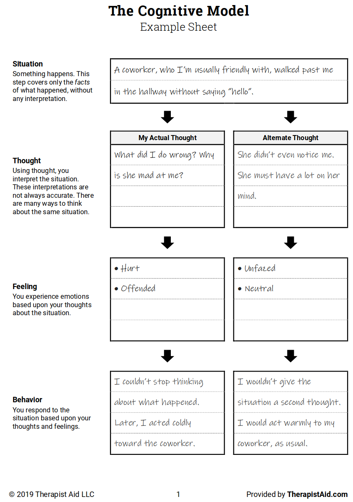
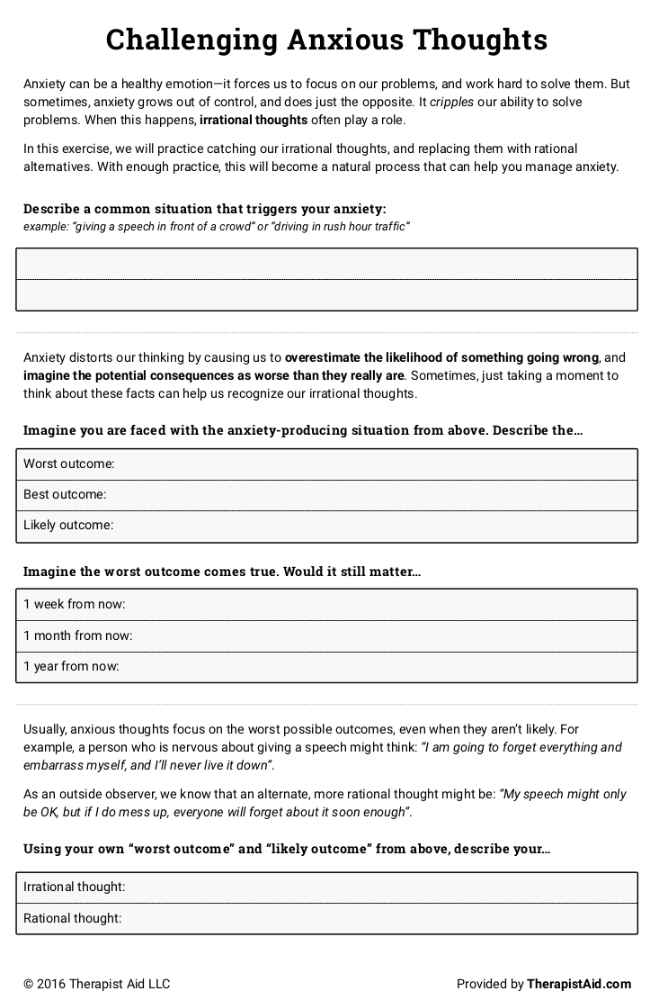
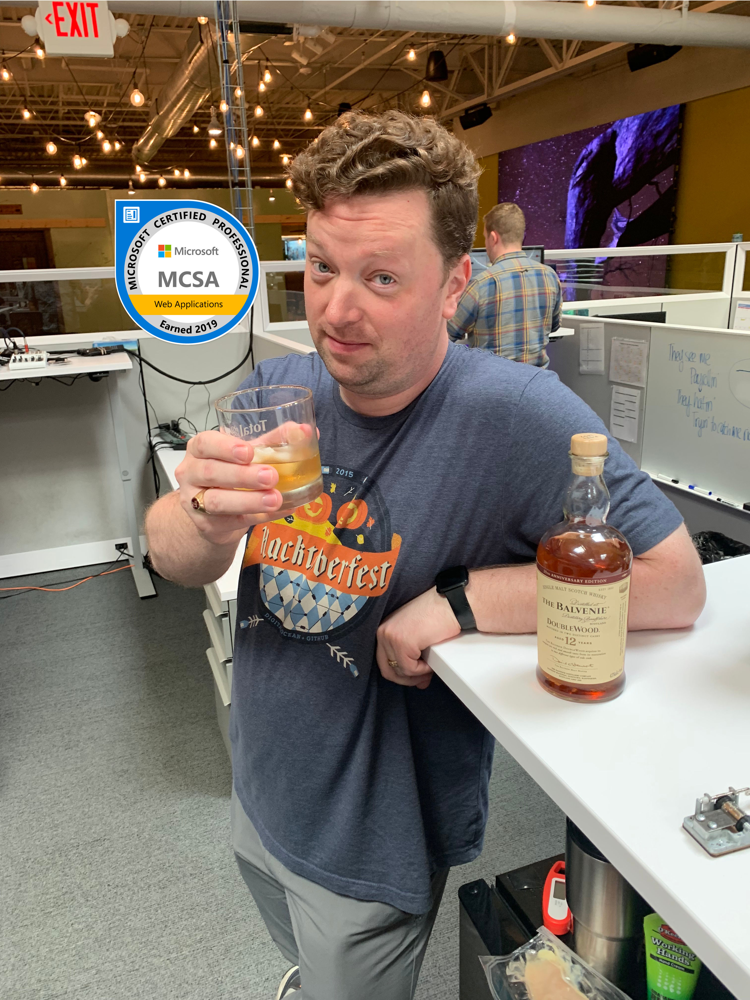

class: title, smokescreen, shelf, no-footer
background-image: url(leo-serrat-533922-unsplash.jpg)

# Stress at Work

## Changing the Narrative with Cognitive Therapy

---
background-image: url(That-Conference-Branding-Slide.png)
background-size: cover

???

Welcome to THAT Conference

- Background images don't appear to scale correctly unless I also apply "background-size: cover" to the slide.-

---
background-image: url(That-Conference-Sponsors-Slide.png)
background-size: cover

???

Sponsors are great.  Without them, That Conference would not be possible.  I'm thankful for them.

---
background-image: url(That-Conference-2020.png)
background-size: cover

???

Please consider coming back next year. Here are the dates!

---
class: title, smokescreen, shelf, no-footer
background-image: url(leo-serrat-533922-unsplash.jpg)

# Stress at Work

## Changing the Narrative with Cognitive Therapy

---
class: img-left

# About Me

- Software Developer at Paradigm
- Luther College Alumnus - Psychology / French majors
- TEALS volunteer
- Admin, [Madison, WI Slack](madisoncommunity.org)
- Human being
- Survivor

@rosslarsonWI

hello@rosslarson.com

THAT Slack : rosslarson

???

Hi. I'm Ross.
---
# Slides

.qrcode.db.fr.w-40pct.ml-4[]

Slides are at https://rosslarson.com/slides/ or you can scan the QR code.

- Ask questions anytime

---
background-image: url(agenda-slide2.jpg)

# Agenda

- Learn about stress, then about workplace stress.
- Learn about Cognitive Behavioral Therapy
- Work through a stressful situation
- Work through a situation that gives you anxiety
- Leave with no problems!

---
class: img-caption

## A note on photos in this presentation.

???

Most stock photos about workplace stress look like this.  It's a person, wearing a suit, with a hand on their face, surrounded by piles of paper.

Looking at stock photos of stressed people is depressing, so I'm making the executive decision to only have this one and to have animal pictures for the rest of the presentation.

---
class: img-caption

# Got it?

???

I'm doing this for your own good.  Trust me.

---
class: img-caption

# Good.

???

Excellent.  Let's move on.

---
class: img-caption

# Let's talk about stress.

???

Before we get too far, I'd like to talk about stress for a bit.  We're not going to be very good at dealing with stress if we haven't defined what it is.

---
class: img-caption

# The Three Types of Stress

???

There are three types of stress.  Some of them are worse than others.

We're going to start small and get bigger as we go on.

---
class: img-left-full

# Acute Stress

- Demands and pressures of the recent past

???
Acute stress comes from demands and pressures of the recent past and...

--
- Anticipated demands and pressures of the near future

???

anticipated demands and pressures of the near future.

--
- Thrilling and exciting in small doses

???

Acute stress is thrilling and exciting in small doses, but too much is exhausting. It causes....

---
class: img-left-full

# Health Effects

- Emotional distress

???
Emotional distress — some combination of anger or irritability, anxiety and depression, the three stress emotions.

--
- Muscular problems

???

Muscular problems including tension headache, back pain, jaw pain and the muscular tensions that lead to pulled muscles and tendon and ligament problems.

--
- Stomach, gut, and bowel problems

???

Stomach, gut and bowel problems such as heartburn, flatulence, diarrhea, constipation and irritable bowel syndrome.

--
- Other stuff

???

Transient overarousal leads to elevation in blood pressure, rapid heartbeat, sweaty palms, heart palpitations, dizziness, migraine headaches, cold hands or feet, shortness of breath and chest pain.

Acute stress can crop up in anyone's life, and it is highly treatable and manageable.

---
class: img-caption
# Episodic Acute Stress

???

This is like acute stress, but over and over again. It is repeated acute stress, ingrained and habitual.
Two types of folks tend to run into this issue.

---
class: img-caption
# Type A Personalities

???

Type A's have an "excessive competitive drive, aggressiveness, impatience, and a harrying sense of time urgency." In addition there is a "free-floating, but well-rationalized form of hostility, and almost always a deep-seated insecurity." These folks have a higher risk of cardiac issues.

---
class: img-caption
# Worry Warts

???

Another form of episodic acute stress comes from ceaseless worry. "Worry warts" see disaster around every corner and pessimistically forecast catastrophe in every situation. The world is a dangerous, unrewarding, punitive place where something awful is always about to happen. These "awfulizers" also tend to be over aroused and tense, but are more anxious and depressed than angry and hostile.

---
class: img-caption, no-footer

# Chronic Stress

???

This is serious stuff.  Like, change your brain chemistry permanently kind of stuff.

Chronic stress is grinding stress.  It wears people away day after day, year after year. Chronic stress destroys lives, bodies, and minds. It wreaks havoc through long-term attrition. It is the stress of poverty, dysfunctional families, violence, abuse, trauma, despised job, ethnic rivalry, war.

---
class: title, smokescreen, shelf, no-footer

 # If you are experiencing chronic stress
 ## Consider seeking professional help.  Please.

???

If you're experiencing chronic stress, please consider seeking professional health, like a licensed therapist. Please.

---
class: img-caption

# Stress at Work

???

Now let's try to focus on stress at work.  Generally stress either comes from work and bleeds into your life or comes from your life and bleeds into your work.

---
background-image: url(stress-pie-chart.png)

Chart courtesy of [stress.org/workplace-stress](https://www.stress.org/workplace-stress):

???

Where does workplace stress come from?
This pie chart from 2006 gives us a clue.

Workloads, people issues, job security, and juggling work and life demands can all contribute.
---
class: img-caption

# So, now what?

???

OK, this exists.  Now what?

---
class: title, smokescreen, shelf, no-footer
background-image: url(penguin1.jpg)

# Cognitive Behavioral Therapy
## [(CBT)](https://www.apa.org/ptsd-guideline/patients-and-families/cognitive-behavioral)

???

How about Cognitive Behavioral Therapy?  I want to stress that it's not the only option, but it can be a good one. Let's learn some more.

Cognitive behavioral therapy (CBT) is a form of psychological treatment.

Numerous research studies suggest that CBT leads to significant improvement in functioning and quality of life. In many studies, CBT has been demonstrated to be as effective as, or more effective than, other forms of psychological therapy or psychiatric medications.

---
class: img-right

# CBT Core Principles

- Problems come from faulty or unhelpful ways of thinking

- Problems come from learned patterns of unhelpful behavior

- But, you can learn to do better!

???

Core principles of CBT:

- Psychological problems are based, in part, on faulty or unhelpful ways of thinking.

- Psychological problems are based, in part, on learned patterns of unhelpful behavior.

- People suffering from psychological problems can learn better ways of coping with them, thereby relieving their symptoms and becoming more effective in their lives.

---
class: img-left

# How stuff interacts

It gets a bit jumbled up, honestly.

???

CBT sounds really simple and straightforward, but remember, we're debugging these systems in production.

Your thoughts, moods, reactions, and behaviors all interact with each other. You may find some of them easier to work with than others.  That is natural. Moods and physical reactions don't just magically change.

---
class: img-left
  
# CBT Treatment Strategies include:

- Facing your fears instead of trying to avoid them.

- Using role playing to prepare for potentially problematic interactions with others.

- Learning to calm your mind and relax your body.

---
class: img-left

# Usually you pick out methods WITH A THERAPIST.

To be clear, I am not a therapist.

???

CBT places an emphasis on helping individuals learn to be their own therapists. Through exercises in the session as well as “homework” exercises outside of sessions, patients/clients are helped to develop coping skills, whereby they can learn to change their own thinking, problematic emotions and behavior.

I'm not saying going to therapy is wrong.  I've been to therapy plenty of times in the last year.

---
class: img-caption

# But, I have worksheets!

???

I have worksheets! They actually come from therapistaid.com which may be the worst domain name I've ever heard of, even though it has some great therapy worksheets. They badly need some hyphens.

---
class: img-caption

# Working Through The Cognitive Model

???

Our first exercise will help us understand the cognitive model a little better.

---
class: img-left

# Four steps:

- Situation

- Thought

- Feeling

- Behavior

Then, think of an alternative!

???

Our first exercise is the cognitive model. Using the first stressful situation you thought of, start by writing how the the situation starts.

Try to write out the thoughts that immediately come to mind in reaction to this situation.

Next, describe the feelings, followed by the behaviors that may have been influenced by your thoughts and feelings.

Think about it for a while, and see if you can come up with some alternative thoughts.  See if your group has any suggestions!

Raise your hand if your group has any questions.

---
class: img-caption

# Sharing Time!

???

Would anyone like to share? I'll share my example afterwards.

---
class: img-caption

# (Some of) My irrational thoughts

???

I have trouble with loud noises sometimes.

---
class: img-caption

# Challenging Anxious Thoughts

---
class: img-left

- Describe your anxious situation

- Think about the outcomes

- See if it matters

---
class: img-caption

# More Sharing Time!

???

Would anyone like to share? I'll share my example afterwards.

---
class: img-caption

# The MCSA Situation

---
class: img-left

# Result of my behavior:

## MCSA:

## Web Applications!

---
class: img-left

# Using CBT concepts to make better requests.

When you make a request:

- Describe the situation

- Mention your reactions/thoughts/feelings

- Request the desired behavior

???

You can use these same tools to ask for things more effectively. Make sure your request addresses the situation, talks about the effect, and leads you to request the change or desired action.

---
class: img-caption

# Conclusions

???

Each of our lives is a story. We tell our story to ourselves, often without realizing it. I hope that some of the techniques that I've talked about today can help you take control of your own story and change the narrative. It's your story. Make sure that you're participating in it.

---
class: img-caption

# Questions?

---
class: img-right

# Thanks!

Slides are at:

https://rosslarson.com/slides/

- @rosslarsonWI

- hello@rosslarson.com

- THAT Slack: rosslarson
???

Thanks for coming!